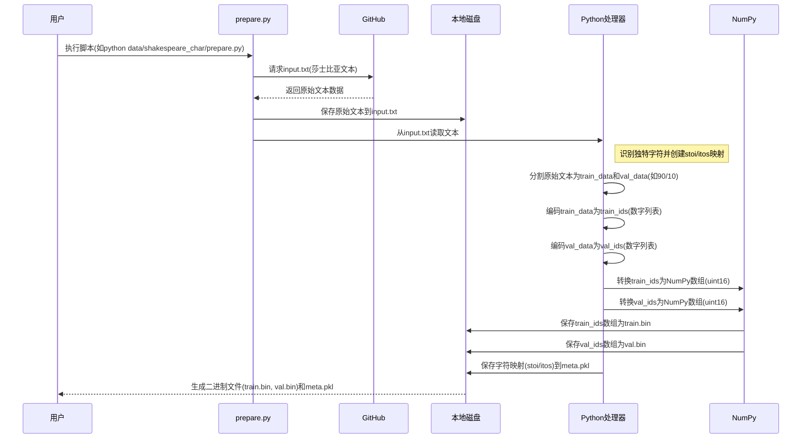

# 第一章：数据预处理与分词

想象你是一位厨师，目标是烤制美味的蛋糕。

不能直接把生鸡蛋、面粉和糖扔进烤箱。首先需要准备食材：打散鸡蛋、称量面粉、甚至过筛去除结块。

这些准备工作确保食材以正确的形态和比例进入烘焙流程。

在GPT这类大语言模型(LLM)的世界里，情况非常相似

我们的"厨师"是GPT模型，"食材"则是海量的人类书写文本。`nanoGPT`项目旨在构建一个迷你GPT模型，而在模型开始学习之前，我们需要专门的"厨房团队"来==预处理原始文本数据==——这正是**数据预处理与分词**的核心任务。

本章将完整展示`nanoGPT`如何将原始文本切分并转化为模型可消化的数字"餐点"。我们的核心目标是理解

> 如何将"Hello world!"这样的文本转换为训练所需的数字序列。

## 为什么需要数据预处理？

根本问题在于计算机（尤其是GPT这类神经网络）无法直接理解单词或字符，它们==只认识**数字**==。

> 因此，我们的首要任务是将所有文本（故事、文章、诗歌等）转换为整数序列。

预处理还包含其他关键步骤：
1. **获取数据**：寻找并下载大规模文本集合
2. **数据分割**：将文本划分为"训练集"（模型学习素材）和"验证集"（用于检查学习效果的"模拟考试"）
3. **分词**：将文本转化为数字标记的核心过程
4. **高效存储**：以模型能快速加载的方式保存这些数字

让我们通过实例了解`nanoGPT`如何处理这些步骤。

## 获取与分割文本数据

在文本转数字之前，我们需要原始文本

`nanoGPT`提供从网络下载或使用本地文件的==脚本==。

以`data/shakespeare_char/prepare.py`脚本为例，该脚本设计用于在字符级别处理莎士比亚作品小数据集：

```python
import os
import requests  # 用于文件下载

# 定义文本文件保存路径
input_file_path = os.path.join(os.path.dirname(__file__), 'input.txt')

# 若文件不存在则下载
if not os.path.exists(input_file_path):
    data_url = 'https://raw.githubusercontent.com/karpathy/char-rnn/master/data/tinyshakespeare/input.txt'
    with open(input_file_path, 'w') as f:
        f.write(requests.get(data_url).text)

# 读取全部文本内容
with open(input_file_path, 'r') as f:
    data = f.read()
print(f"数据集字符长度: {len(data):,}")
```
这种脚本获取原数据操作在前文[[项目详解][boost搜索引擎#1] 概述 | 去标签 | 数据清洗 | scp](https://lvynote.blog.csdn.net/article/details/143083224)亦有用到

这段代码首先检查`input.txt`（微型莎士比亚数据集）是否存在，若不存在则从GitHub下载保存

随后将全部内容读入`data`变量，此时`data`即保存了待处理的原始文本。

接下来将`data`分割为两部分：大部分用于**训练**模型，小部分用于**验证**：

```python
# 创建训练集和验证集
n = len(data)
train_data = data[:int(n*0.9)]  # 90%训练集
val_data = data[int(n*0.9):]    # 10%验证集
```
> 防过拟合小tip

这里90%的莎士比亚文本进入`train_data`供模型学习，剩余10%进入`val_data`用于定期检查模型在未见文本上的表现——这对防止模型死记硬背训练数据至关重要。

## 分词：文本转数字

这是最关键的步骤。==分词即将文本拆分为称为**标记(token)**的小单元，并为每个标记分配唯一ID==。

`nanoGPT`演示了两种主要分词方法：

### 方法1：字符级分词（简单版）

字符级分词将每个独立字符（如'a'、'b'、' '、'!'）视为一个标记。这是最基础的方法，适合理解核心概念。

继续看`data/shakespeare_char/prepare.py`。加载数据后，脚本识别所有独特字符：

```python
# 获取文本中所有独特字符
chars = sorted(list(set(data)))
vocab_size = len(chars)  # 独特字符总数
print("全部独特字符:", ''.join(chars))
print(f"词汇表大小: {vocab_size:,}")

# 创建字符到整数的映射(stoi = string to integer)
stoi = { ch:i for i,ch in enumerate(chars) }
# 创建整数到字符的逆向映射(itos = integer to string)
itos = { i:ch for i,ch in enumerate(chars) }

# 文本与标记ID的转换函数
def encode(s):
    return [stoi[c] for c in s]  # 编码器：输入字符串，输出整数列表
def decode(l):
    return ''.join([itos[i] for i in l])  # 解码器：输入整数列表，输出字符串
```
这部分代码首先找出莎士比亚文本中的所有独特字符（如'a'、'b'、'c'、'.'、' '、'!'），然后创建两个"字典"：
* `stoi`（字符到整数）将每个字符映射为唯一数字（标记ID）。例如'a'对应`0`，'b'对应`1`
* `itos`（整数到字符）是逆向映射

`vocab_size`表示数据集中独特字符（即独特标记ID）的数量。微型莎士比亚数据集通常约65个。

现在可以用`encode`函数将`train_data`和`val_data`转为数字列表：

```python
# 将训练集和验证集编码为整数
train_ids = encode(train_data)
val_ids = encode(val_data)
print(f"训练集标记数: {len(train_ids):,}")
print(f"验证集标记数: {len(val_ids):,}")
```
此时`train_ids`和`val_ids`就是模型所需的长整数列表

例如文本"Hello"可能变为`[20, 10, 23, 23, 26]`（假设'H'=20，'e'=10，'l'=23，'o'=26）。

### 方法2：==字节对编码(BPE)==配合`tiktoken`（进阶版，LLM常用）

字符级分词虽简单，但对大文本效率低

例如常见词"the"会被拆为3个标记('t','h','e')，尽管它们常一起出现。BPE通过为常见字符序列（甚至完整单词）创建标记来解决这个问题。

`nanoGPT`使用OpenAI的`tiktoken`库实现BPE处理更真实的数据集。查看`data/shakespeare/prepare.py`（注意与`shakespeare_char`的区别）：

```python
import tiktoken
import numpy as np  # 用于高效数值处理

# ...（数据下载与分割逻辑同前）...

# 使用tiktoken的gpt2 bpe编码器
enc = tiktoken.get_encoding("gpt2")
train_ids = enc.encode_ordinary(train_data)
val_ids = enc.encode_ordinary(val_data)
print(f"训练集标记数: {len(train_ids):,}")
print(f"验证集标记数: {len(val_ids):,}")
```
这里不再手动创建`stoi`和`itos`，而是使用`tiktoken.get_encoding("gpt2")`加载OpenAI为GPT-2预训练的BPE分词器。该分词器已==掌握将文本拆分为常见片段（子词）并分配ID的方法==。

`encode_ordinary()`方法用这个强大的BPE分词器将`train_data`和`val_data`转为整数列表。

这些标记ID通常更大（GPT-2最多50256），因为它们代表比单个字符更复杂的标记。

（本质其实还是我们一层不够高，那就再套一层实现的思想）

对于超大数据集（如网络文本集合"OpenWebText"），`nanoGPT`在`data/openwebtext/prepare.py`中结合使用`tiktoken`和Hugging Face的`datasets`库实现高效加载处理：

```python
import tiktoken
from datasets import load_dataset  # huggingface数据集库

enc = tiktoken.get_encoding("gpt2")

if __name__ == '__main__':
    dataset = load_dataset("openwebtext", num_proc=8)  # 加载海量数据集
    # ...（分割逻辑）...

    def process(example):
        ids = enc.encode_ordinary(example['text'])  # 用tiktoken编码文本
        ids.append(enc.eot_token)  # 添加文本结束特殊标记
        out = {'ids': ids, 'len': len(ids)}
        return out

    tokenized = dataset["train"].map(  # 对整个数据集应用分词
        process,
        remove_columns=['text'],
        desc="正在分词",
        num_proc=8,
    )
    # ...（保存逻辑）...
```
这段代码显示即使对超大数据集，核心的`enc.encode_ordinary()`方法保持不变

`datasets`的`map`函数帮助高效处理数百万文档。`enc.eot_token`是特殊标记（文本结束），用于区分不同文档内容。

## 保存为二进制文件

所有文本转为整数ID列表后，`nanoGPT`需要高效保存它们。相比纯文本文件（体积大加载慢），它们被存储为**二进制文件**（`.bin`）。

```python
import numpy as np  # 数值计算库

# ...（分词完成，得到train_ids和val_ids）...

# 导出为bin文件
train_ids = np.array(train_ids, dtype=np.uint16)  # 列表转NumPy数组
val_ids = np.array(val_ids, dtype=np.uint16)      # 使用uint16节省内存

# 将数组直接保存为二进制文件
train_ids.tofile(os.path.join(os.path.dirname(__file__), 'train.bin'))
val_ids.tofile(os.path.join(os.path.dirname(__file__), 'val.bin'))
```
这段代码用`numpy`将`train_ids`和`val_ids`列表转为高效数组。

- `dtype=np.uint16`指定每个数字存为16位无符号整数（GPT-2的标记ID最大值50256在此范围内，因`2^16=65536`）。
- `.tofile()`生成紧凑的二进制文件（`train.bin`和`val.bin`），训练时可快速加载。

字符级分词还会==额外保存`meta.pkl`文件存储`stoi`和`itos`映射==，便于后续将标记ID转回可读字符：（memo）

```python
import pickle  # 用于保存Python对象

# ...（vocab_size, itos, stoi已定义）...

# 保存元信息供后续编码/解码使用
meta = {
    'vocab_size': vocab_size,
    'itos': itos,
    'stoi': stoi,
}
with open(os.path.join(os.path.dirname(__file__), 'meta.pkl'), 'wb') as f:
    pickle.dump(meta, f)
```
`meta.pkl`相当于小型字典供模型参考。

## 如何使用数据预处理脚本

可通过终端运行这些预处理脚本。例如用字符级分词处理微型莎士比亚数据集：

```bash
python data/shakespeare_char/prepare.py
```

运行后将看到类似输出：
```
数据集字符长度: 1,115,394
全部独特字符:
 !$&',-.3:;?ABCDEFGHIJKLMNOPQRSTUVWXYZabcdefghijklmnopqrstuvwxyz
词汇表大小: 65
训练集标记数: 1,003,854
验证集标记数: 111,540
```
在`data/shakespeare_char/`目录会生成`train.bin`、`val.bin`和`meta.pkl`。

处理BPE版微型莎士比亚数据集：

```bash
python data/shakespeare/prepare.py
```
将在`data/shakespeare/`生成`train.bin`和`val.bin`。

处理更大的OpenWebText数据集：

```bash
python data/openwebtext/prepare.py
```
**注意**：这将下载超大数据集(54GB)，耗时耗空间

最终在`data/openwebtext/`生成`train.bin`(~17GB)和`val.bin`(~8.5MB)。

## 技术原理：数据预处理流程

用序列图展示字符级莎士比亚数据处理的完整流程：


该图展示了==原始文本从网络到Python处理，最终存储为高效二进制文件==的完整旅程。

## 分词方法对比

以下是`nanoGPT`使用的两种分词方法对比：

| 特性           | 字符级分词(如`shakespeare_char`)           | 字节对编码(BPE)配合`tiktoken`(如`shakespeare`, `openwebtext`) |
| :------------- | :----------------------------------------- | :----------------------------------------------------------- |
| **标记单元**   | 单个字符(如'H','e','l','l','o')            | 常见子词或完整单词(如"Hello","world","the")                  |
| **词汇表大小** | 较小(如微型莎士比亚约65)                   | 较大(如GPT-2的`tiktoken`约50,000)                            |
| **复杂度**     | 更简单易懂                                 | 更复杂，采用最优子词查找算法                                 |
| **输出长度**   | 相同文本产生更长标记序列                   | 相同文本产生更短标记序列(更高效)                             |
| **适用场景**   | 小数据集/教学用途/需精细字符控制的特定任务 | ==大语言模型标准方案，高效处理多样化文本==                   |

## 本章小结

本章我们学习了`nanoGPT`如何为模型准备"食材"：下载原始文本、分割为训练验证集、最重要的是将其转化为数字标记。

- 我们探索了两种分词方法：简单的字符级方案和高效但更复杂的BPE方案（使用`tiktoken`）。

- 最终这些标记ID被存入紧凑的二进制文件（`.bin`），为训练阶段的高速加载做好优化。

正如厨师需要精心准备的食材，我们的GPT模型需要==妥善处理的数字数据==。现在数据已就绪，接下来将认识"厨师"本身——GPT模型架构=。

[下一章：GPT模型架构](02_gpt_model_architecture_.md)

