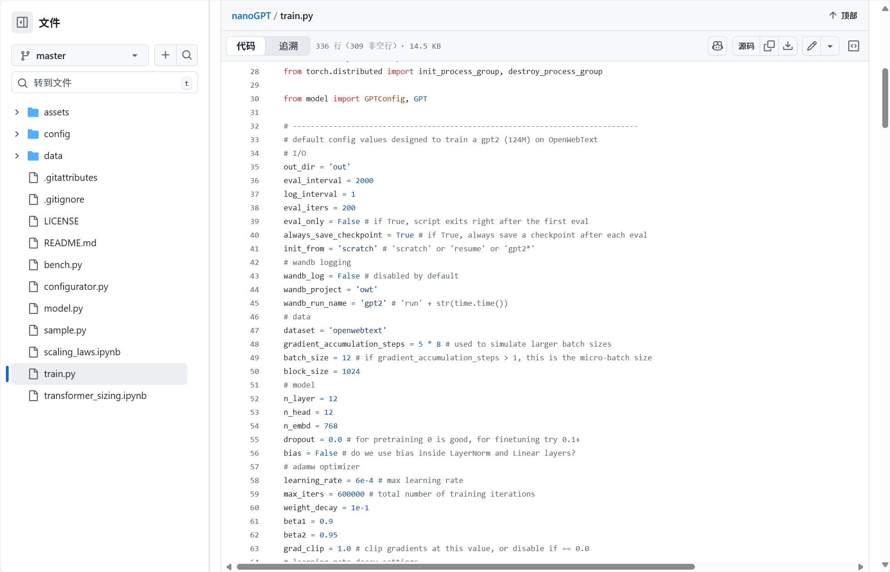
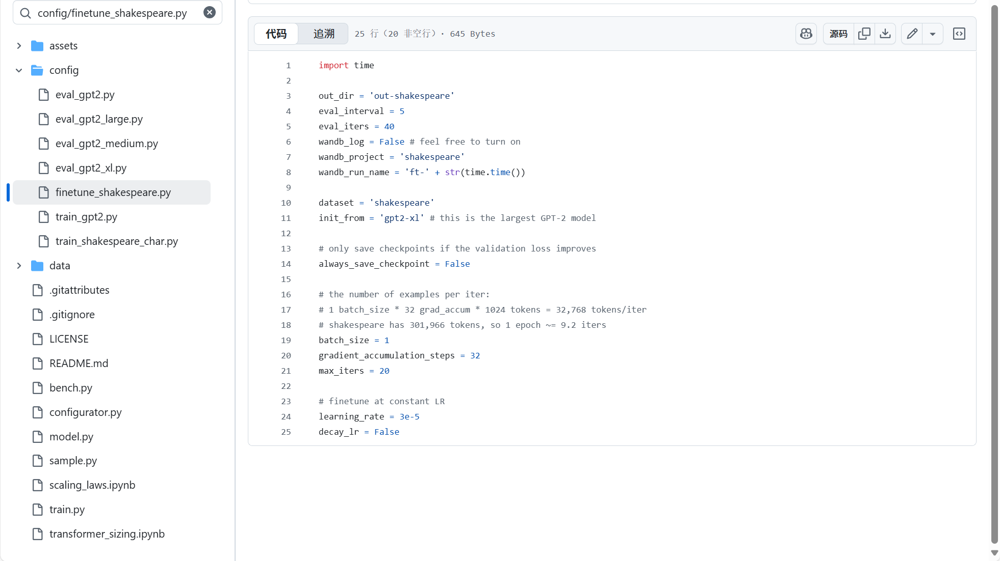
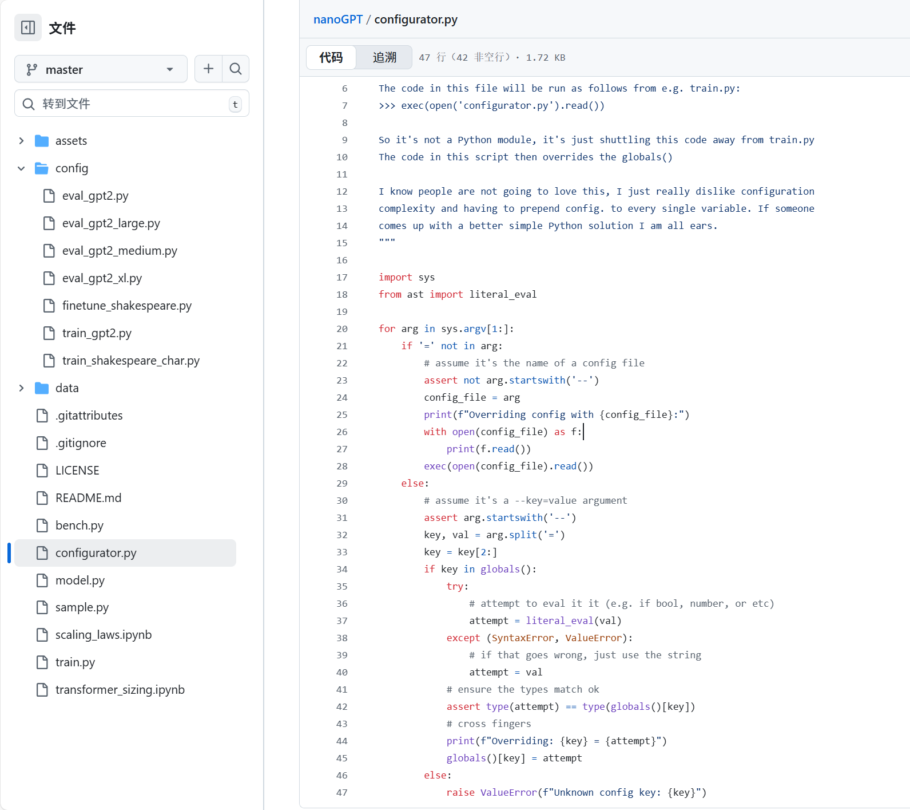
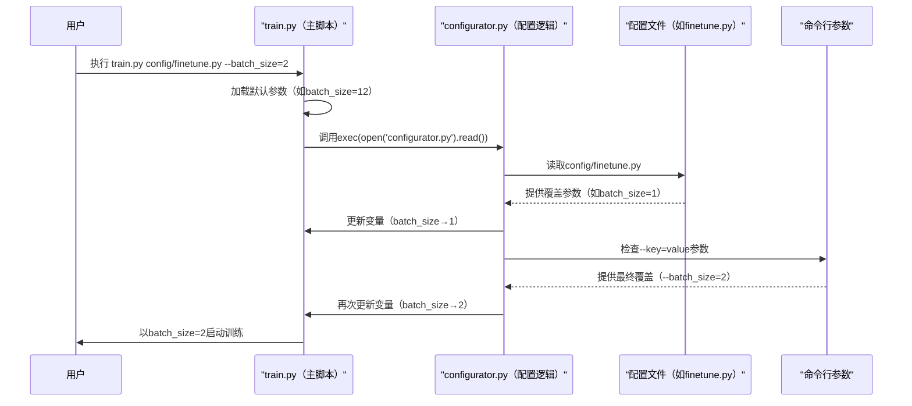

# 第三章：配置系统

欢迎回来

在[第二章：GPT模型架构](02_gpt_model_architecture_.md)中，我们学习了如何设计GPT模型的"大脑"，理解了`注意力机制`和`多层感知器`等复杂组件。

现在有了模型蓝图，我们需要教会这个大脑如何学习。

> 但如何决定*学习方式*？应该训练多少步？每次处理多少文本量？

这些关键决策直接影响模型表现。

假设造了一个超级智能机器人厨师。你清楚它的"大脑"如何运作（架构），但现在需要下达指令："快速烤个小蛋糕（简单模型）"，或者"花几小时准备豪华宴席（大模型）"，亦或是"调整现有菜谱做成素食版（微调）"。

如果直接在核心代码中修改这些指令会非常麻烦

这就是`nanoGPT`的**配置系统**的用武之地。它像是中央控制面板，集中管理==所有调节GPT模型训练、评估和文本生成的旋钮与开关==。

可以定义和管理各种超参数设置，而无需直接修改核心代码。(许多优秀的项目都是这种解耦合的架构)

## 为什么需要配置系统？

训练强大语言模型涉及众多参数，例如：
* `batch_size`：模型单次处理的文本样本量
* `learning_rate`：模型调整理解的速度
* `max_iters`：训练步数总量
* `model_size`（通过`n_layer`/`n_head`/`n_embd`体现）：模型规模复杂度
* `dataset`：训练数据源（如莎士比亚文集或开放网络文本）

若无配置系统，每次实验都需要手动修改`train.py`中的变量——容易出错且难以追溯成功实验的具体参数。

配置系统提供灵活的三层控制：
1. **默认设置**：建立基础参数模板
2. **配置文件覆盖**：快速切换预设方案（如"训练小型GPT-2"与"微调大型GPT-2"）
3. **命令行临时调整**：通过启动参数快速测试不同值

这种设计确保实验可复现性，大幅提升研发效率。这就是我们的多功能控制台

## 配置系统实战指南



### 1. 默认参数基准

打开`train.py`可见预定义的==**默认参数**==，这些是未指定配置时的基准值：

```python
# 摘自train.py
# -----------------------------------------------------------------------------
# 默认配置值：用于在OpenWebText上训练124M参数的GPT-2
# 输入输出
out_dir = 'out'
eval_interval = 2000
log_interval = 1
eval_iters = 200
# ...更多默认值...
# 数据
dataset = 'openwebtext'
batch_size = 12
block_size = 1024
# ...
# 学习率衰减设置
learning_rate = 6e-4 # 最大学习率
max_iters = 600000 # 总训练步数
# -----------------------------------------------------------------------------
```
直接运行`python train.py`将采用这些值，例如使用`openwebtext`数据集，批大小`12`，总步数`600000`。

### 2. 配置文件覆盖



`config/`目录中的预置配置文件可快速切换训练方案。以`config/finetune_shakespeare.py`为例：

```python
# 摘自config/finetune_shakespeare.py
import time

out_dir = 'out-shakespeare' # 修改输出目录
eval_interval = 5           # 调整评估频率
dataset = 'shakespeare'     # 改用莎士比亚数据集
init_from = 'gpt2-xl'       # 从大型预训练GPT-2初始化
batch_size = 1              # 微调用小批量
gradient_accumulation_steps = 32 # 多步累积梯度
max_iters = 20              # 减少迭代次数（微调更快）
learning_rate = 3e-5        # 专用微调学习率
```

通过启动参数加载配置：
```bash
python train.py config/finetune_shakespeare.py
```
此时==会优先采用配置文件的参数==，如`batch_size`变为`1`，`max_iters`降为`20`。

### 3. 命令行参数微调

如需临时调整个别参数，无需修改文件：

```bash
python train.py config/finetune_shakespeare.py --batch_size=2 --max_iters=10
```
此时参数优先级为：
1. 默认值（`batch_size=12`）
2. 配置文件覆盖为`1`
3. 命令行最终设为`2`

这种分层控制体系极具灵活性

## 技术实现：configurator.py的魔法



这套系统的核心是`configurator.py`脚本，其工作原理如下：



### 关键技术：exec()与globals()

`train.py`通过以下代码实现动态配置：

```python
# 摘自train.py
exec(open('configurator.py').read()) # 通过命令行或配置文件覆盖参数
```

> `exec()`函数会执行`configurator.py`的代码，而`globals()`字典允许修改主脚本的全局变量。例如这段配置处理器代码：

```python
# 摘自configurator.py
for arg in sys.argv[1:]:
    if '=' not in arg:
        # 作为配置文件路径处理
        with open(arg) as f:
            exec(f.read()) # 执行配置文件中的赋值语句
    else:
        # 处理--key=value参数
        key, val = arg[2:].split('=') # 去掉"--"前缀
        if key in globals():
            globals()[key] = literal_eval(val) # 类型安全地转换值
```

## 配置优先级总结

| 配置源         | 描述                      | 优先级 |
| -------------- | ------------------------- | ------ |
| **默认值**     | train.py中硬编码的变量    | 最低   |
| **配置文件**   | config/目录中的.py文件    | 中     |
| **命令行参数** | --key=value形式的启动参数 | 最高   |

## 小结

我们剖析了`nanoGPT`的配置控制系统，这个灵活的三层体系（默认值→配置文件→命令行）让模型训练过程既规范又易于调整

通过`configurator.py`的巧妙设计，实现了参数管理的自动化与安全性。

现在，数据、模型架构和控制系统都已就绪，接下来就是让我们的GPT模型真正开始学习了

[下一章：训练流程编排](04_training_loop_orchestration_.md)

