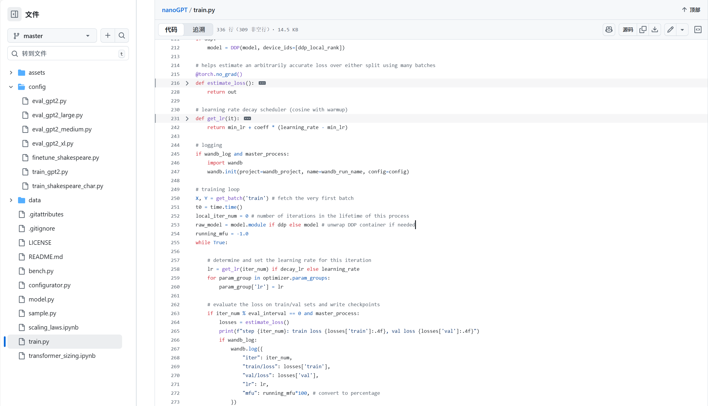
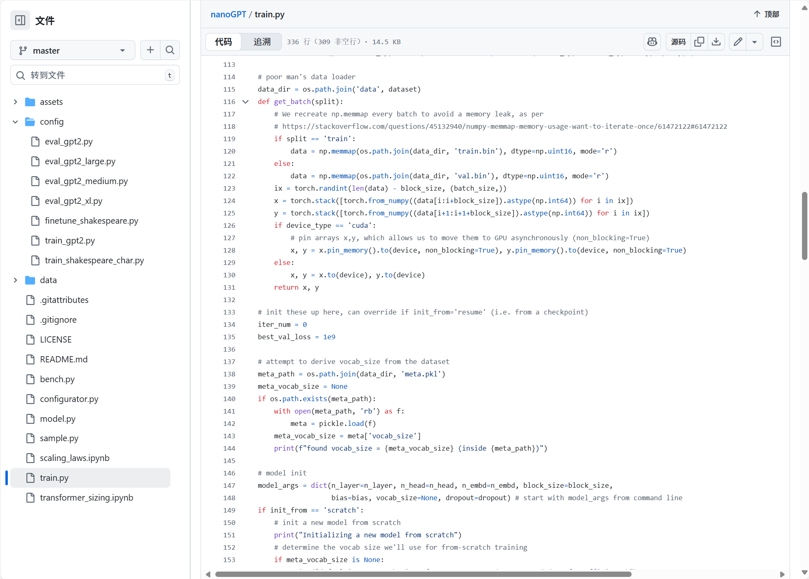
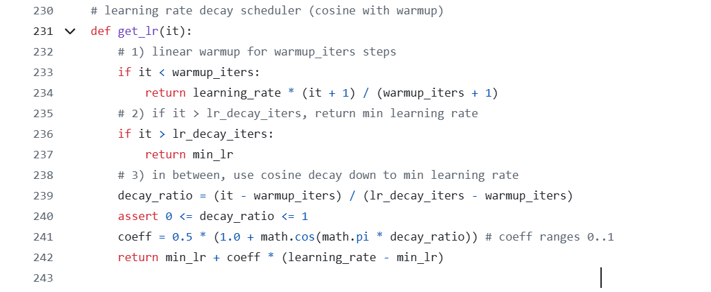
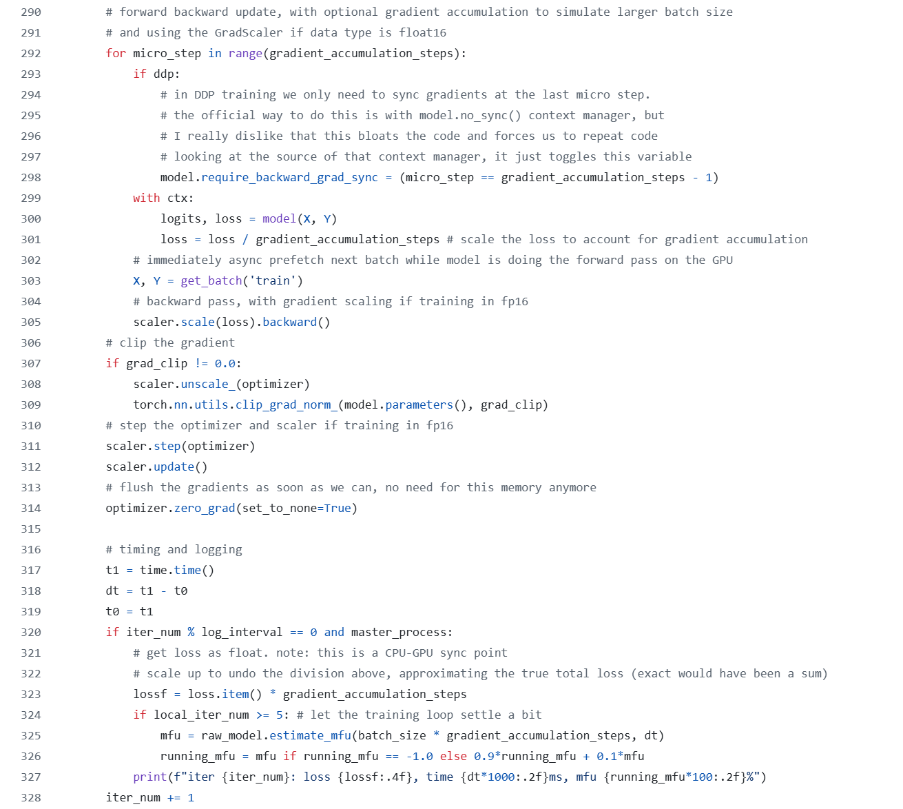
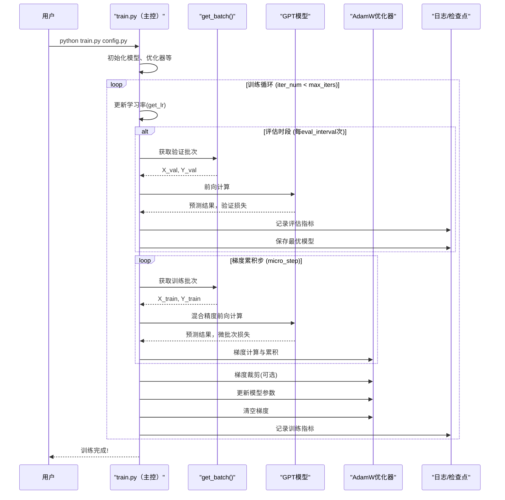

# 第四章：训练流程编排

欢迎回来

在[第三章：配置系统](03_configuration_system_.md)中，我们学习了如何精确调整`nanoGPT`模型的各项参数，就像操作控制面板上的旋钮和开关。现在数据已就绪，模型架构已定义，训练设置已配置，是时候让一切运转起来了！我们需要一个核心系统来协调所有组件，让模型真正开始*学习*。

想象你是一位交响乐团的指挥。所有乐器（数据、模型、优化器）都已就位，乐谱（配置参数）也已备好。

但如果没有指挥来协调每件乐器的演奏时机、音量和节奏，这些只是零散的部件。**训练流程编排**正是`nanoGPT`的指挥系统。

本章聚焦于`train.py`——学习过程的核心。

这个中央控制系统管理着GPT模型的整个学习历程，其核心任务是迭代执行：==输入数据→模型预测→`从错误中学习`→更新内部参数→记录进度==，直到模型成为熟练的语言大师。

## 训练流程的核心职责

核心目标很简单：**用预处理数据训练GPT模型预测下一个标记，通过大量迭代逐步提升预测能力**。

为实现这一目标，训练循环需要：
1. **获取数据**：加载批量的标记ID（预处理好的"食材"）
2. **前向传播**：将标记输入GPT模型获取预测
3. **计算损失**：量化预测误差
4. **反向传播**：分析模型各部分对错误的贡献
5. **优化权重**：调整内部参数以改进预测
6. **学习管理**：控制学习节奏、记录日志、保存模型
7. **协同工作**：处理多GPU分布式训练等高级场景

让我们深入探索`nanoGPT`如何编排这些步骤，将初始模型培养成语言生成大师。

## 训练循环实战(`train.py`)



训练主脚本是`train.py`（在[配置系统](03_configuration_system_.md)中已提及）。运行该脚本即启动完整训练流程。

例如训练字符级莎士比亚GPT：
```bash
python train.py config/train_shakespeare_char.py
```
该命令让`train.py`加载`config/train_shakespeare_char.py`中的设置（数据集、模型规模、学习率等），开始训练历程。脚本会在终端打印训练进度。

## 核心组件

`train.py`通过协调多个关键模块实现模型学习。

### 1. 数据供给器(`get_batch`)



如同厨师需要持续供应食材，模型需要源源不断的标记数据批次。`get_batch`函数负责从预处理好的二进制文件(`train.bin`, `val.bin`，见[第一章](01_data_preparation___tokenization_.md))中高效提取数据：

```python
# 摘自train.py（简化版）
def get_batch(split):
    # 从.bin文件高效加载数据
    data = np.memmap(os.path.join(data_dir, f'{split}.bin'), dtype=np.uint16, mode='r')
    
    # 随机选择序列起始位置
    ix = torch.randint(len(data) - block_size, (batch_size,))
    
    # 提取输入(x)和目标(y)序列
    x = torch.stack([torch.from_numpy((data[i:i+block_size]).astype(np.int64)) for i in ix])
    y = torch.stack([torch.from_numpy((data[i+1:i+1+block_size]).astype(np.int64)) for i in ix])
    
    # 数据送至指定设备(GPU/CPU)
    x, y = x.to(device), y.to(device)
    return x, y
```
* **`np.memmap`**：直接从磁盘按需加载数据，适合超大数据集
* **随机索引**：确保每批数据多样性
* **输入/目标**：若输入x是`[1,5,2]`，目标y则为`[5,2,7]`（7是2的后继标记）
* **设备转移**：自动适配GPU/CPU环境

该函数在训练过程中被反复调用，持续提供新数据。

### 2. 优化器(`model.configure_optimizers`)

优化器是模型的"学习引擎"。在计算预测损失后，优化器利用误差信息调整模型参数。`nanoGPT`采用深度学习常用的`AdamW`优化器：

```python
# 摘自train.py
optimizer = model.configure_optimizers(weight_decay, learning_rate, (beta1, beta2), device_type)
```
`model.configure_optimizers`（定义于`model.py`）配置优化器参数：
* `weight_decay`：防止模型过拟合的正则化技术
* `learning_rate`：参数调整步长
* `beta1/beta2`：AdamW优化器的内部调节参数

### 3. 学习率调度器(`get_lr`)

学习率（参数调整幅度）至关重要。



初始高学习率可加速早期学习，但后期可能错过最优解。常见策略是初始较低→逐步升温→缓慢衰减，即**学习率调度**：

```python
# 摘自train.py（简化版）
def get_lr(it):
    # 1) 线性升温阶段
    if it < warmup_iters:
        return learning_rate * (it + 1) / (warmup_iters + 1)
    # 2) 衰减阶段结束后保持最小学习率
    if it > lr_decay_iters:
        return min_lr
    # 3) 余弦衰减至最小学习率
    decay_ratio = (it - warmup_iters) / (lr_decay_iters - warmup_iters)
    coeff = 0.5 * (1.0 + math.cos(math.pi * decay_ratio))
    return min_lr + coeff * (learning_rate - min_lr)

# 训练循环中应用：
lr = get_lr(iter_num) if decay_lr else learning_rate
for param_group in optimizer.param_groups:
    param_group['lr'] = lr
```
`get_lr`根据当前训练步数`iter_num`动态计算学习率，确保训练过程平稳高效。

### 4. 性能评估(`estimate_loss`)

为监控模型真实学习效果（而非死记硬背），需定期在训练集和验证集上评估表现：

```python
# 摘自train.py（简化版）
@torch.no_grad() # 评估时不计算梯度（节省资源）
def estimate_loss():
    out = {}
    model.eval() # 切换为评估模式
    for split in ['train', 'val']:
        losses = torch.zeros(eval_iters)
        for k in range(eval_iters):
            X, Y = get_batch(split)
            with ctx: # 混合精度上下文
                logits, loss = model(X, Y)
            losses[k] = loss.item()
        out[split] = losses.mean()
    model.train() # 恢复训练模式
    return out
```
* **`@torch.no_grad`**：禁用梯度计算，提升评估效率
* **双模式切换**：某些层（如Dropout）在训练/评估时行为不同
* **多批次平均**：通过`eval_iters`次评估取平均，确保结果稳定

### 5. 混合精度训练(`torch.amp.autocast`, `GradScaler`)

现代GPU使用`float16`/`bfloat16`低精度计算可提升速度并降低显存占用，但可能导致数值不稳定。PyTorch提供全套解决方案：

```python
# 摘自train.py（简化版）
device_type = 'cuda' if 'cuda' in device else 'cpu'
ptdtype = {'float32': torch.float32, 'bfloat16': torch.bfloat16, 'float16': torch.float16}[dtype]
ctx = nullcontext() if device_type == 'cpu' else torch.amp.autocast(device_type=device_type, dtype=ptdtype)
scaler = torch.cuda.amp.GradScaler(enabled=(dtype == 'float16'))

# 训练循环中：
with ctx: # 启用混合精度
    logits, loss = model(X, Y)
scaler.scale(loss).backward() # 梯度缩放防止下溢
scaler.step(optimizer) # 参数更新
scaler.update() # 缩放器重置
```
* **`autocast`**：自动为算子选择合适精度，关键部分保持`float32`
* **`GradScaler`**：放大梯度防止`float16`训练时的下溢问题

### 6. 梯度累积

当GPU显存不足支持大批量时，可通过**梯度累积**模拟大批量效果：

```python
# 摘自train.py（简化版）
for micro_step in range(gradient_accumulation_steps):
    with ctx:
        logits, loss = model(X, Y)
        loss = loss / gradient_accumulation_steps # 损失归一化
    scaler.scale(loss).backward() # 梯度累积

# 所有微批次处理后：
scaler.step(optimizer) # 统一更新参数
scaler.update()
optimizer.zero_grad() # 清空梯度
```
通过将总损失除以累积步数，确保最终梯度等效于大批量训练。

### 7. 分布式训练(DDP)



大规模训练需使用**分布式数据并行(DDP)**跨多GPU/多机器训练：

```python
# 摘自train.py（简化版）
ddp = int(os.environ.get('RANK', -1)) != -1 # 检查DDP是否启用
if ddp:
    init_process_group(backend=backend) # 初始化进程通信
    model = DDP(model, device_ids=[ddp_local_rank]) # 包装模型

# 训练循环中：
for micro_step in range(gradient_accumulation_steps):
    if ddp:
        # 仅在最后微步同步梯度减少通信开销
        model.require_backward_grad_sync = (micro_step == gradient_accumulation_steps - 1)
    # ...(常规训练步骤)...
```
* **进程组初始化**：建立GPU间通信管道
* **DDP包装器**：自动处理梯度同步
* **梯度同步优化**：只在必需时进行通信

## 核心训练循环

`train.py`的主循环是`while True`结构，持续运行直到达到`max_iters`。以下是其关键流程：



核心代码结构：
```python
# 摘自train.py（主循环核心）
X, Y = get_batch('train') # 首次数据加载
while True:
    # 1. 学习率更新
    lr = get_lr(iter_num) if decay_lr else learning_rate
    
    # 2. 定期评估
    if iter_num % eval_interval == 0:
        losses = estimate_loss()
        # ...(保存检查点逻辑)...
        
    # 3. 梯度累积训练
    for micro_step in range(gradient_accumulation_steps):
        with ctx:
            logits, loss = model(X, Y)
            loss = loss / gradient_accumulation_steps
        X, Y = get_batch('train') # 预取下一批
        scaler.scale(loss).backward()
        
    # 4. 参数更新与日志
    scaler.step(optimizer)
    scaler.update()
    optimizer.zero_grad()
    
    # 5. 终止条件
    if iter_num > max_iters:
        break
```

## 小结

我们剖析了`nanoGPT`训练流程的指挥系统，涵盖：
* **数据管道**：`get_batch`的高效数据供给
* **优化机制**：AdamW优化器的参数更新策略
* **学习率调度**：动态调整训练节奏的`get_lr`
* **评估体系**：双模式下的性能监控
* **加速技术**：混合精度与梯度累积的协同优化
* **扩展能力**：多GPU分布式训练集成

理解这套==编排机制==是掌握语言模型学习原理的关键。

现在模型已具备学习能力，下一步是探索如何==保存学习成果及加载预训练模型==。

[下一章：检查点与预训练模型加载](05_checkpointing_and_pre_trained_model_loading_.md)

