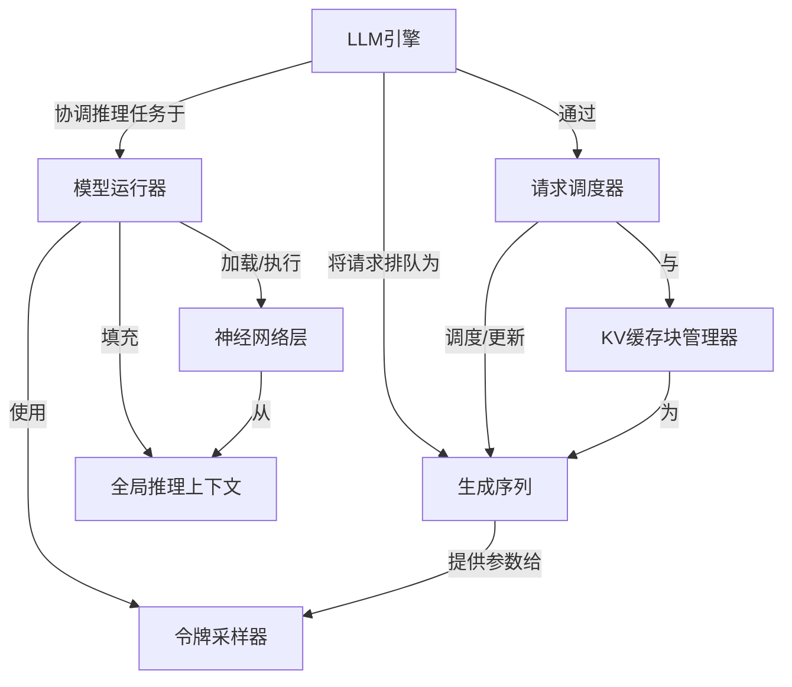

链接：[GeeeekExplorer/nano-vllm: Nano vLLM](https://github.com/GeeeekExplorer/nano-vllm)

# docs：nano-vllm

`nano-vllm`是一个**高效推理系统**，专门用于通过*大型语言模型*生成文本。

它就像一个**智能工厂**，接收用户输入的提示词，==智能地管理它们以充分利用GPU资源==，然后通过神经网络处理这些提示，快速生成*高质量的文本补全*。

该系统针对高吞吐量和低延迟进行了优化，即使在多GPU环境下也能高效运行。

## 可视化

## 章节

1. [LLM引擎](01_llm_engine_.md)
2. [生成序列](02_generation_sequence_.md)
3. [请求调度器](03_request_scheduler_.md)
4. [KV缓存块管理器](04_kv_cache_block_manager_.md)
5. [模型运行器](05_model_runner_.md)
6. [神经网络层](06_neural_network_layers_.md)
7. [全局推理上下文](07_global_inference_context_.md)
8. [令牌采样器](08_token_sampler_.md)

---

