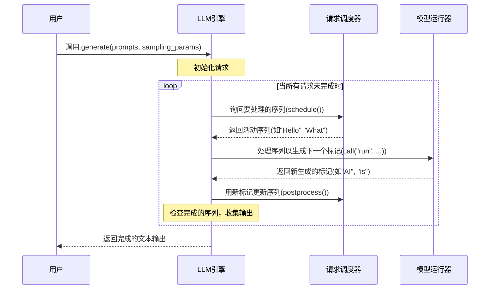

# 第1章：LLM引擎

想象一下，你想与一个人工智能(AI)模型对话，比如让它"讲一个关于勇敢骑士的故事"

你输入请求后，AI就会为你生成一个完整的故事。这背后是如何实现的？特别是当许多人可能同时向AI提问时，系统如何运作？

这就是**LLM引擎**发挥作用的地方

LLM引擎就像一个精密工厂的中央控制室。这个"工厂"旨在使用强大的大型语言模型(LLM)生成文本。它的主要工作是接收请求，确保它们被高效处理，发送给实际的AI模型(我们工厂中的"工人")，然后收集所有生成的部分，给你最终的完整文本。

## 它解决了什么问题？

如果没有LLM引擎，运行AI模型进行文本生成将变得复杂且缓慢。你需要手动：
1. 将文本转换为计算机理解的数字(标记化)
2. 将这些数字发送给AI模型
3. 管理许多进行中的请求而不让它们纠缠在一起
4. 逐块(逐个标记)处理文本生成
5. 将所有块重新组合成可读文本
6. 可能需要同时使用多个强大的图形处理器(GPU)

LLM引擎处理所有这些复杂任务，让你只需专注于提问并快速获得答案。它是一个协调者，确保即使在处理多个并发请求和跨多个GPU时，也能实现流畅、快速和高效的文本生成。

## 如何使用LLM引擎

在`nano-vllm`中，你通过一个名为`LLM`的简单类与LLM引擎交互。让我们看看如何使用它来生成文本。

首先，需要创建一个`LLM`实例，告诉它使用哪个AI模型。

```python
from nanovllm import LLM, SamplingParams
import os
from transformers import AutoTokenizer

# 下载的AI模型路径(例如Qwen3-0.6B)
model_path = os.path.expanduser("~/huggingface/Qwen3-0.6B/")

# 创建LLM引擎实例
llm = LLM(model_path)

# 你还需要一个标记器来准备文本
tokenizer = AutoTokenizer.from_pretrained(model_path)
```
在这个代码片段中，我们通过指向本地AI模型来设置`LLM`。

`LLM`类处理启动引擎所需的所有内部设置。我们还获取了一个`tokenizer`，这对于将人类可读文本转换为AI模型理解的数字(标记)以及反向转换至关重要。

接下来，你定义想要生成的文本类型(你的提示)以及希望AI如何生成它(采样参数)。

```python
# 定义AI应如何生成文本(例如，它应该有多大的创造性)
sampling_params = SamplingParams(temperature=0.6, max_tokens=256)

# 你对AI的问题或提示
prompts = [
    "introduce yourself",
    "list all prime numbers within 100",
]

# (可选但推荐做法)为聊天模型格式化提示
prompts = [
    tokenizer.apply_chat_template(
        [{"role": "user", "content": prompt}],
        tokenize=False, # 我们还不标记化，LLM引擎会处理
        add_generation_prompt=True,
    )
    for prompt in prompts
]
```
这里，`SamplingParams`让你控制`temperature`(输出有多创造性或"随机")和`max_tokens`(生成响应的最大长度)等参数。我们还准备了提示，确保它们为我们的AI模型正确格式化。

最后，你使用`generate`方法让AI生成文本：

```python
# 生成文本！
outputs = llm.generate(prompts, sampling_params)

# 打印结果
for prompt, output in zip(prompts, outputs):
    print("\n")
    print(f"Prompt: {prompt!r}")
    print(f"Completion: {output['text']!r}")
```
**示例输出**

```
Prompt: '<s>User\nintroduce yourself'
Completion: '你好！我是一个大型语言模型，由Google训练。我在这里帮助你完成各种任务，并尽我所能提供信息。今天我能为你做什么？'

Prompt: '<s>User\nlist all prime numbers within 100'
Completion: '100以内的质数有：2, 3, 5, 7, 11, 13, 17, 19, 23, 29, 31, 37, 41, 43, 47, 53, 59, 61, 67, 71, 73, 79, 83, 89, 97。'
```
如你所见，`llm.generate()`方法接收你的提示和采样设置，并返回AI生成的文本。中间所有复杂步骤都由LLM引擎自动处理。

## 内部机制：LLM引擎如何工作

让我们揭开帷幕，看看当调用`llm.generate()`时发生了什么。

将LLM引擎想象成管弦乐队的指挥。当要求它生成文本时，它协调几个专门的部分(其他组件)来产生最终的表演。

以下是事件的简化序列：


这个图表显示LLM引擎持续循环，协调生成过程。它询问[请求调度器](03_request_scheduler_.md)哪些请求已准备好，将它们发送给[模型运行器](05_model_runner_.md)进行计算，然后用新生成的标记更新请求。这个循环重复，直到所有请求完全生成。

### `LLM`类：入口点

`LLM`类设计为你与`nano-vllm`库交互的主要方式。它非常简单：

```python
# nanovllm/llm.py
from nanovllm.engine.llm_engine import LLMEngine

class LLM(LLMEngine):
    pass
```
`nanovllm`中的`LLM`类只是继承自`LLMEngine`。这意味着==`LLM`直接获得`LLMEngine`的所有强大功能==。

实例化`LLM`，但所有繁重的工作都在`LLMEngine`类中完成。

### `LLMEngine`类：真正的指挥家

让我们看看`nanovllm/engine/llm_engine.py`中`LLMEngine`的核心：

```python
# nanovllm/engine/llm_engine.py
import torch.multiprocessing as mp
from nanovllm.config import Config
from nanovllm.engine.scheduler import Scheduler
from nanovllm.engine.model_runner import ModelRunner
from transformers import AutoTokenizer

class LLMEngine:

    def __init__(self, model, **kwargs):
        # 1. 加载配置和模型详情
        config = Config(model, **kwargs)

        # 2. 设置模型运行器(可能跨多个GPU)
        self.ps = [] # 用于并行进程
        self.events = [] # 用于进程间通信
        ctx = mp.get_context("spawn")
        for i in range(1, config.tensor_parallel_size):
            # 为其他GPU创建单独的进程
            process = ctx.Process(target=ModelRunner, args=(config, i, event))
            process.start()
            self.ps.append(process)
            self.events.append(event)
        # 主GPU的主模型运行器
        self.model_runner = ModelRunner(config, 0, self.events)

        # 3. 初始化标记器和调度器
        self.tokenizer = AutoTokenizer.from_pretrained(config.model, use_fast=True)
        config.eos = self.tokenizer.eos_token_id # 序列结束标记
        self.scheduler = Scheduler(config) # 管理传入请求

        # 确保程序退出时正确清理
        atexit.register(self.exit)
```
当`LLMEngine`初始化时：
1. **配置(`Config`)**：它加载重要设置，如模型路径、一次处理的最大标记数和GPU内存使用情况。
2. **模型运行器设置**：这是关键步骤！LLM引擎准备一个或多个[模型运行器](05_model_runner_.md)实例。如果你有`tensor_parallel_size > 1`(意味着你想使用多个GPU进行更快处理)，它会==巧妙地启动每个额外GPU的单独进程==。这允许AI模型的不同部分同时在不同GPU上运行。`self.model_runner`是主要的运行器，与其他运行器协调。
3. **标记器和调度器**：它初始化一个`tokenizer`将文本转换为数字标记并反向转换。它还设置了[请求调度器](03_request_scheduler_.md)，它将负责管理和优先处理所有文本生成请求。

### 添加新请求(`add_request`)

当要求LLM引擎生成文本时，请求首先通过`add_request`：

```python
# nanovllm/engine/llm_engine.py
from nanovllm.sampling_params import SamplingParams
from nanovllm.engine.sequence import Sequence

class LLMEngine:
    # ... (init方法) ...

    def add_request(self, prompt: str | list[int], sampling_params: SamplingParams):
        # 如果提示是纯文本，将其转换为数字(标记)
        if isinstance(prompt, str):
            prompt = self.tokenizer.encode(prompt)

        # 创建一个"Sequence"对象来跟踪这个特定的生成
        seq = Sequence(prompt, sampling_params)

        # 将序列交给调度器管理
        self.scheduler.add(seq)
```
在`add_request`中：
* 文本提示使用`tokenizer`转换为数字列表(标记)。
* 创建一个`Sequence`对象。这个对象保存关于你特定文本生成请求的所有信息，包括原始提示、迄今为止生成的标记和`SamplingParams`。你可以在[生成序列](02_generation_sequence_.md)中了解更多。
* 这个`Sequence`然后传递给[请求调度器](03_request_scheduler_.md)，它将管理其被处理的顺序。

### 生成循环(`step`和`generate`)

直接调用的`generate`方法实际上运行一个循环，反复调用`step`方法。`step`方法是每个周期中标记生成的实际工作发生的地方。

```python
# nanovllm/engine/llm_engine.py
# ... (导入和类定义) ...

    def step(self):
        # 1. 询问调度器哪些序列已准备好处理
        seqs, is_prefill = self.scheduler.schedule()

        # 2. 将这些序列发送给模型运行器以生成下一个标记
        # 模型运行器处理实际的AI模型计算
        token_ids = self.model_runner.call("run", seqs, is_prefill)

        # 3. 用新生成的标记更新序列
        self.scheduler.postprocess(seqs, token_ids)

        # 4. 识别并收集任何已完成生成的序列
        outputs = [(seq.seq_id, seq.completion_token_ids) for seq in seqs if seq.is_finished]
        
        # 返回完成的输出和处理的标记数以进行性能跟踪
        return outputs, len(seqs)

    def is_finished(self):
        # 检查调度器是否已完成所有请求
        return self.scheduler.is_finished()

    def generate(self, prompts, sampling_params, use_tqdm: bool = True) -> list[str]:
        # 将所有初始提示添加为请求
        for prompt, sp in zip(prompts, sampling_params):
            self.add_request(prompt, sp)
        
        outputs = {} # 存储已完成序列的结果

        # 持续执行步骤直到所有请求完成
        while not self.is_finished():
            output, num_tokens = self.step() # 调用主要工作方法
            
            # 存储任何完成的输出
            for seq_id, token_ids in output:
                outputs[seq_id] = token_ids
                if use_tqdm:
                    # 如果启用，更新进度条
                    pass # 为简洁起见简化

        # 将最终标记ID解码回人类可读文本
        outputs = [outputs[seq_id] for seq_id in sorted(outputs.keys())]
        outputs = [{"text": self.tokenizer.decode(token_ids), "token_ids": token_ids} for token_ids in outputs]
        
        return outputs
```
`generate`方法充当保持整个生成过程运行的顶层循环。它反复调用`self.step()`，直到`self.is_finished()`告诉它所有请求的文本生成已完成。

在`step`内部：
1. **调度(`self.scheduler.schedule()`)**：[请求调度器](03_request_scheduler_.md)决定哪些活动请求(序列)应接下来发送给AI模型。这对于高效批处理和许多请求的处理至关重要。
2. **模型执行(`self.model_runner.call("run", ...)`)**：选定的序列传递给[模型运行器](05_model_runner_.md)。这是实际神经网络(AI模型)在GPU上进行计算并生成下一组标记的地方。
3. **后处理(`self.scheduler.postprocess(...)`)**：新生成的标记然后发送回[请求调度器](03_request_scheduler_.md)，它更新相应的`Sequence`对象。它还检查是否有任何序列已完成生成(例如，达到`max_tokens`或生成序列结束标记)。

这个`schedule -> run model -> postprocess`的持续循环是LLM引擎如何协调所有活动请求逐标记生成文本的方式。

## 结论

刚刚完成了对`nano-vllm`的第一次探索

现在明白**LLM引擎**是协调整个文本生成过程的中央大脑。它==接收==你的提示，==管理==它们，将它们==发送给底层==AI模型，并高效地==收集==结果。

看到了如何使用`LLM`类生成文本，并瞥见了`LLMEngine`如何设置关键组件，如[请求调度器](03_request_scheduler_.md)和[模型运行器](05_model_runner_.md)，并管理文本生成的持续循环。

在下一章中，我们将聚焦于关键角色之一：[生成序列](02_generation_sequence_.md)。这是==LLM引擎用来跟踪*每个单独请求*在生成过程中进展的方式==。

[生成序列](02_generation_sequence_.md)

