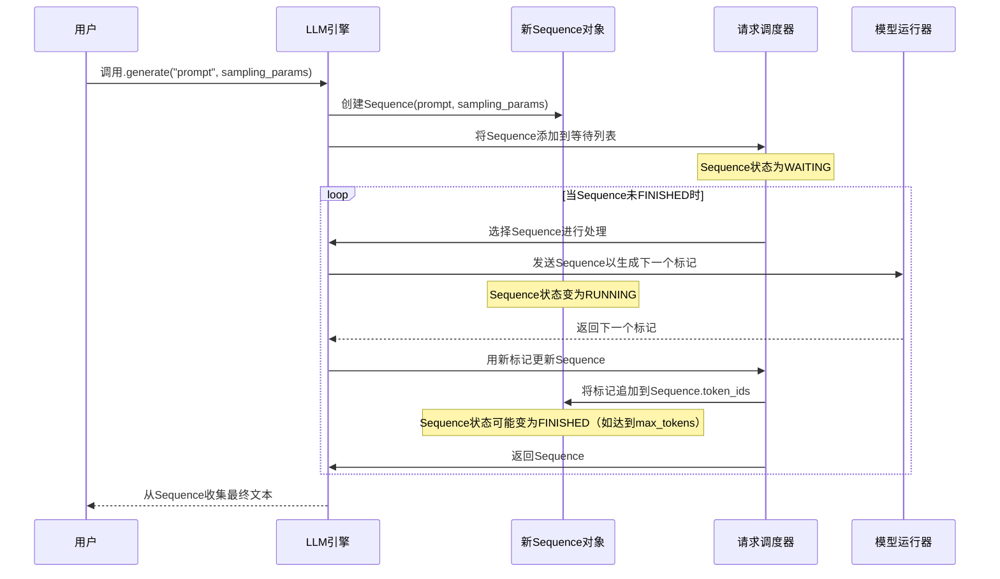

# 第2章：生成序列

在[第1章：LLM引擎](01_llm_engine_.md)中，我们了解到[LLM引擎](01_llm_engine_.md)是管理文本生成的中枢大脑。

接收请求（比如"讲个故事"），并协调一切以获取响应

但当有*多个*请求时会发生什么？或者当一个请求需要逐块生成文本时，引擎如何保持所有这些独立任务的组织并跟踪它们的进度？

这就是**生成序列**的用武之地

## 什么是生成序列？

想象你在工作中管理几个重要项目。对于每个项目，会有一个专门的文件夹或"项目文件"。这个文件包含：
* 项目的原始请求或目标
* 迄今为止完成的所有工作
* 当前状态（如"等待开始"、"进行中"、"已完成"）
* 该特定项目的任何特殊说明

在`nano-vllm`中，**生成序列**（代码中通常简称为`Sequence`）就像这些项目文件之一。

它代表一个从开始到结束的单个持续文本生成请求。它是一个特殊对象，保存与一个特定生成任务相关的*所有内容*。

## 为什么需要它？

如果没有生成序列，[LLM引擎](01_llm_engine_.md)会非常混乱。如果你同时请求两个故事，它如何知道哪个生成的标记属于哪个故事？它如何知道每个故事何时完成？

`Sequence`对象通过以下方式解决这个问题：
1. **==跟踪进度==**：它知道初始提示和为此特定请求生成的所有新标记。
2. **==管理状态==**：它告诉引擎此请求是在等待、当前正在处理还是已完成。
3. **==存储指令==**：它保存此特定生成的特定规则（如AI应有多大的创造性，或最大长度）。
4. **==提高效率==**：它允许[LLM引擎](01_llm_engine_.md)和[请求调度器](03_request_scheduler_.md)高效管理许多请求，确保每个请求都能轮到且不会与其他请求混淆。

简而言之，每个`Sequence`对象是==单个生成任务的唯一"收据"或"票据"==，确保其被正确且完整地处理

## 生成序列

让我们看看`Sequence`对象存储的关键部分：

| 序列部分            | 存储内容                                     | 类比                   |
| :------------------ | :------------------------------------------- | :--------------------- |
| `seq_id`            | 此特定请求的唯一标识符。                     | 项目编号               |
| `status`            | 当前状态：`WAITING`、`RUNNING`或`FINISHED`。 | 白板上的项目状态       |
| `token_ids`         | 输入提示标记 + 迄今为止生成的所有标记。      | 项目文件中的所有文档   |
| `num_prompt_tokens` | 原始输入提示中有多少标记。                   | 原始项目简介           |
| `num_tokens`        | 迄今为止的总标记数（提示 + 生成）。          | 项目文件中的总页数     |
| `sampling_params`   | 指令如`temperature`、`max_tokens`等。        | 此项目的特殊说明       |
| `block_table`       | 此序列的数据在GPU内存中的存储位置。          | 此项目数据的文件柜位置 |

这些大部分直接作为属性存储在`nanovllm/engine/sequence.py`中的`Sequence`对象中。

## LLM引擎如何使用序列

当你使用`llm.generate()`时，不会直接创建或管理`Sequence`对象。相反，[LLM引擎](01_llm_engine_.md)为你完成所有繁重工作

让我们回顾一下在[第1章：LLM引擎](01_llm_engine_.md)中看到的==`add_request`方法。这是你的人类可读提示正式成为`Sequence`对象的地方==：

```python
# nanovllm/engine/llm_engine.py
from nanovllm.sampling_params import SamplingParams
from nanovllm.engine.sequence import Sequence # 我们正在导入Sequence类！

class LLMEngine:
    # ... (init方法) ...

    def add_request(self, prompt: str | list[int], sampling_params: SamplingParams):
        # 1. 如果提示是文本，将其转换为数字（标记）
        if isinstance(prompt, str):
            prompt = self.tokenizer.encode(prompt)

        # 2. <<< 这里！为此请求创建一个全新的Sequence对象 >>>
        seq = Sequence(prompt, sampling_params)

        # 3. 将此新序列交给请求调度器管理
        self.scheduler.add(seq)
```
当你调用`llm.generate()`时，[LLM引擎](01_llm_engine_.md)遍历你的提示，并为*每个提示*创建一个新的`Sequence`对象。然后这个`Sequence`对象被交给[请求调度器](03_request_scheduler_.md)进行处理。

### 序列的生命周期

一旦创建，`Sequence`会经历一个旅程：



1. **创建**：[LLM引擎](01_llm_engine_.md)创建一个`Sequence`对象，填充初始提示标记和你提供的`SamplingParams`。其`status`设置为`WAITING`。
2. **调度**：[请求调度器](03_request_scheduler_.md)获取`WAITING`序列，并在轮到它们被实际AI模型处理时将其移动到`RUNNING`。
3. **生成**：[模型运行器](05_model_runner_.md)获取`RUNNING`序列，通过AI模型处理它们，并产生一个或多个新标记。
4. **更新**：[请求调度器](03_request_scheduler_.md)接收这些新标记，并告诉`Sequence`对象将它们追加到`token_ids`列表。它还检查`Sequence`是否满足完成标准（如生成足够的标记，或遇到序列结束标记）。
5. **完成**：如果`Sequence`已完成生成，其`status`更改为`FINISHED`。[LLM引擎](01_llm_engine_.md)然后收集其最终生成的文本。

### `Sequence`类内部

让我们看看`nanovllm/engine/sequence.py`中`Sequence`类的简化版本，了解它如何管理其内部状态：

```python
# nanovllm/engine/sequence.py
from enum import Enum, auto
from nanovllm.sampling_params import SamplingParams

# 生成序列的可能状态
class SequenceStatus(Enum):
    WAITING = auto()   # 等待轮到它
    RUNNING = auto()   # 当前正在被模型处理
    FINISHED = auto()  # 生成完成

class Sequence:
    # 用于KV Cache的块大小的类变量
    block_size = 256 

    def __init__(self, token_ids: list[int], sampling_params: SamplingParams = SamplingParams()):
        # 为此序列分配唯一ID
        self.seq_id = next(Sequence.counter) 
        self.status = SequenceStatus.WAITING # 初始为等待
        self.token_ids = list(token_ids)     # 存储初始提示标记
        self.num_tokens = len(self.token_ids)
        self.num_prompt_tokens = len(token_ids) # 原始提示中有多少标记

        # 存储生成指令
        self.temperature = sampling_params.temperature
        self.max_tokens = sampling_params.max_tokens
        self.ignore_eos = sampling_params.ignore_eos

        # 这些用于管理GPU内存（KV Cache），稍后解释！
        self.block_table = []
        self.num_cached_tokens = 0
```
这个`__init__`方法为新生成请求设置所有初始细节

它存储提示、采样规则，并将其标记为`WAITING`。

随着新标记的生成，`Sequence`需要添加它们：

```python
# nanovllm/engine/sequence.py
# ... (类的其余部分) ...

    def append_token(self, token_id: int):
        """将新生成的标记添加到此序列。"""
        self.token_ids.append(token_id)
        self.num_tokens += 1 # 更新总标记数
        self.last_token = token_id # 跟踪最后一个标记
```
`append_token`方法很简单：它只是==将新标记添加到`token_ids`列表并更新总数==。

最后，`Sequence`需要知道何时完成：

```python
# nanovllm/engine/sequence.py
# ... (类的其余部分) ...

    @property
    def is_finished(self):
        """检查序列是否已完成生成。"""
        return self.status == SequenceStatus.FINISHED

    @property
    def num_completion_tokens(self):
        """返回提示*之后*生成的标记数。"""
        return self.num_tokens - self.num_prompt_tokens

    @property
    def completion_token_ids(self):
        """仅返回生成的标记（不包括提示）。"""
        return self.token_ids[self.num_prompt_tokens:]
```
`is_finished`属性简单地反映当前`status`

`num_completion_tokens`和`completion_token_ids`属性对于仅获取AI生成的响应（与初始提示分开）非常有用。[请求调度器](03_request_scheduler_.md)将使用这些属性以及`max_tokens`和`ignore_eos`设置来决定何时将序列的状态更改为`FINISHED`。

## 结论

**生成序列**是`nano-vllm`中的一个基本概念。

- 充当每个文本生成请求的专用"项目文件"，细致地跟踪其提示、生成的标记、状态和特定指令。
- ==将所有这些信息封装到单个对象中==，[LLM引擎](01_llm_engine_.md)可以高效管理多个并发生成任务而不会混淆。

现在已经了解了[LLM引擎](01_llm_engine_.md)如何创建这些`Sequence`对象以及它们在整个生成过程中如何演变。在下一章中，我们将深入探讨[请求调度器](03_request_scheduler_.md)，它是负责组织和优先处理这些`Sequence`对象的组件，决定哪些对象由AI模型处理以及何时处理。

[请求调度器](03_request_scheduler_.md)

