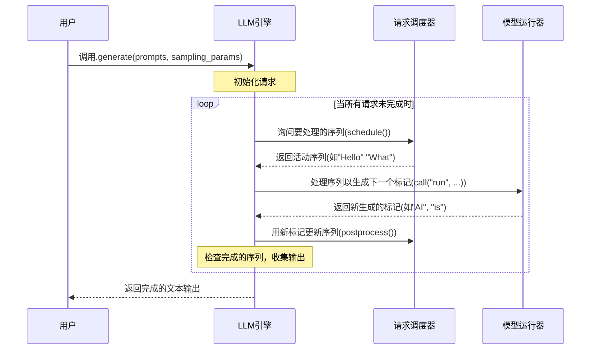

# 第3章：请求调度器

在[第2章：生成序列](02_generation_sequence_.md)中，我们了解到每个文本生成请求都被封装在一个称为`Sequence`的整洁包中。将这些序列想象成单独的航班，每个航班都有目的地（期望的文本）和特定指令（`SamplingParams`）。但当许多这样的"航班"（序列）都想使用相同的有限资源（如GPU，"跑道"或"空域"）时会发生什么？

这就是**请求调度器**的用武之地！

请求调度器就像一个繁忙机场的空中交通管制员。它的工作是管理所有传入和正在进行的文本生成请求，确保它们被平稳、高效地处理，而不会相互冲突。它决定哪些序列可以"起飞"（开始在GPU上处理），哪些需要"排队等候"甚至"中途暂停"以便为其他序列让路。

## 它解决了什么问题？

如果没有智能的请求调度器，同时为多个用户生成文本将会混乱且缓慢：

1. **资源冲突**：如果每个人都试图同时使用GPU，它将会过载并显著变慢，甚至崩溃。
2. **低效**：一次运行一个请求浪费了GPU的能力。同时处理多个请求要快得多，就像多架飞机快速连续使用跑道一样。
3. **不公平**：一些请求可能会永远等待，而其他请求可能会独占资源。
4. **内存管理**：文本生成需要大量内存（尤其是KV缓存，我们将在[第4章：KV缓存块管理器](04_kv_cache_block_manager_.md)中介绍）。调度器需要确保每个序列有足够的空间。

请求调度器通过智能协调序列的流动来解决这些问题，确保GPU始终忙于有用的工作，并且所有请求最终都能完成。

## 请求调度器的关键职责

我们的空中交通管制员（请求调度器）有三个主要职责：

* **批处理（分组航班）**：想象一组小型飞机都飞往相似的目的地。空中交通管制员可能会让它们一个接一个地紧密起飞，最大化跑道使用率。类似地，调度器将多个[生成序列](02_generation_sequence_.md)分组，并将它们一次性发送给[模型运行器](05_model_runner_.md)（AI模型）。这非常高效，因为GPU同时处理多个任务比逐个处理要好得多。
* **优先级（优先处理重要航班）**：有时会有紧急降落或VIP航班。管制员会优先处理它们。调度器优先处理准备就绪或可能已经等待一段时间的序列，确保整体进度。
* **抢占（暂停航班或让它们返回）**：如果一架紧急的大型飞机需要降落，小型飞机可能会被要求盘旋一会儿甚至返回登机口。调度器可能会暂时暂停（抢占）一个正在运行的[生成序列](02_generation_sequence_.md)，释放其GPU内存，并将其放回等待队列。这在新的高优先级请求到达或内存不足时至关重要。

## LLM引擎如何使用请求调度器

作为`nano-vllm`的用户，你不会直接与`请求调度器`交互。它是[LLM引擎](01_llm_engine_.md)的一个内部智能组件，在幕后默默工作。

让我们快速回顾[第1章：LLM引擎](01_llm_engine_.md)中的主循环，看看调度器在哪里发挥作用：


这个图表突出了`schedule()`和`postprocess()`调用。每次[LLM引擎](01_llm_engine_.md)需要生成新标记时，它首先询问`请求调度器`*哪些*[生成序列](02_generation_sequence_.md)已准备好运行。在[模型运行器](05_model_runner_.md)生成标记后，`LLM引擎`将它们返回给`请求调度器`以更新序列并检查它们的状态。

## 内部机制：`Scheduler`类

`请求调度器`在`nanovllm/engine/scheduler.py`中实现为`Scheduler`类。让我们探索其核心功能。

### 初始化（`__init__`）

当[LLM引擎](01_llm_engine_.md)启动时，它会创建一个`Scheduler`实例：

```python
# nanovllm/engine/llm_engine.py (简化)
from nanovllm.engine.scheduler import Scheduler
# ...

class LLMEngine:
    def __init__(self, model, **kwargs):
        # ... 其他设置 ...
        self.scheduler = Scheduler(config) # 请求调度器诞生！
```

`Scheduler`本身需要设置其内部组件：

```python
# nanovllm/engine/scheduler.py (简化)
from collections import deque
from nanovllm.config import Config
from nanovllm.engine.sequence import Sequence, SequenceStatus
from nanovllm.engine.block_manager import BlockManager # 用于内存管理！

class Scheduler:
    def __init__(self, config: Config):
        self.max_num_seqs = config.max_num_seqs # 一次运行的最大序列数
        self.max_num_batched_tokens = config.max_num_batched_tokens # 每批的最大标记数
        self.eos = config.eos # 序列结束标记ID

        # 管理序列的GPU内存（KV缓存）
        self.block_manager = BlockManager(config.num_kvcache_blocks, config.kvcache_block_size)

        # 根据状态保存序列的队列
        self.waiting: deque[Sequence] = deque() # 等待开始或恢复的序列
        self.running: deque[Sequence] = deque() # 当前正在处理或最近处理的序列
```
`Scheduler`初始化了两个重要的队列：`self.waiting`用于耐心等待轮到的序列，`self.running`用于正在积极处理的序列。它还设置了一个`BlockManager`，这对于高效管理GPU内存至关重要，我们将在[第4章：KV缓存块管理器](04_kv_cache_block_manager_.md)中介绍。

### 添加新请求（`add`）

当[LLM引擎](01_llm_engine_.md)接收到一个新提示时，它会创建一个[生成序列](02_generation_sequence_.md)对象，并使用`add`方法将其交给调度器：

```python
# nanovllm/engine/llm_engine.py (简化)
# ...
class LLMEngine:
    # ...
    def add_request(self, prompt: str | list[int], sampling_params: SamplingParams):
        # ... (创建Sequence 'seq') ...
        self.scheduler.add(seq) # 将新序列交给调度器！
```

`add`方法本身非常简单：

```python
# nanovllm/engine/scheduler.py (简化)
class Scheduler:
    # ...
    def add(self, seq: Sequence):
        self.waiting.append(seq) # 只需将序列添加到等待队列！
```
新的[生成序列](02_generation_sequence_.md)简单地加入`waiting`队列的末尾，就像一架新飞机加入起飞队列一样。

### 决定运行什么（`schedule`）

这是空中交通管制员工作的核心！`schedule`方法决定哪些序列将在当前步骤中被[模型运行器](05_model_runner_.md)处理。它智能地选择一批序列，优先处理那些正在启动或继续生成的序列。

`schedule`方法分为两个主要阶段：

1. **预填充阶段**：这是针对新请求或被抢占的请求。这些序列的整个提示需要首先由AI模型处理。调度器尝试用尽可能多的等待序列填充一个批次。
2. **解码阶段**：一旦序列的提示被处理，它进入解码阶段，AI模型为其逐个生成新标记。调度器专注于保持这些正在运行的序列向前推进。

以下是`schedule`方法的简化视图：

```python
# nanovllm/engine/scheduler.py (简化)
class Scheduler:
    # ...
    def schedule(self) -> tuple[list[Sequence], bool]:
        scheduled_seqs = []
        num_batched_tokens = 0

        # 首先尝试调度新的（预填充）序列
        while self.waiting: # 如果有等待的序列
            seq = self.waiting[0] # 查看第一个
            # 检查批次和GPU内存是否有足够空间
            if (num_batched_tokens + len(seq) > self.max_num_batched_tokens or
                not self.block_manager.can_allocate(seq)): # 链接到KV缓存！
                break # 没有足够空间或内存，暂时停止

            # 如果有空间，分配内存并移动到运行状态
            self.block_manager.allocate(seq) # 保留GPU内存块
            num_batched_tokens += len(seq) - seq.num_cached_tokens
            seq.status = SequenceStatus.RUNNING
            self.waiting.popleft() # 从等待中移除
            self.running.append(seq) # 添加到运行中
            scheduled_seqs.append(seq)

        if scheduled_seqs:
            return scheduled_seqs, True # 返回预填充批次

        # 如果没有新序列可以调度，尝试继续运行（解码）序列
        while self.running and num_batched_tokens < self.max_num_batched_tokens:
            seq = self.running.popleft() # 获取一个运行中的序列
            # 检查是否可以追加新标记（需要为KV缓存分配新内存块）
            while not self.block_manager.can_append(seq): # 链接到KV缓存！
                # 如果内存不足，抢占另一个运行中的序列
                if self.running:
                    self.preempt(self.running.pop()) # 抢占最后一个运行中的序列
                else:
                    self.preempt(seq) # 如果没有其他选择，抢占自己
                    break # 现在无法调度此序列
            else:
                self.block_manager.may_append(seq) # 为下一个标记保留新块
                scheduled_seqs.append(seq)
                num_batched_tokens += 1 # 为此序列生成一个标记
        
        # 将选定的运行序列添加回运行队列的前端
        # 这使它们在下一步中优先继续解码。
        self.running.extendleft(reversed(scheduled_seqs))
        return scheduled_seqs, False # 返回解码批次
```
这个方法可能看起来很复杂，但其核心思想很简单：
* 它首先尝试从`waiting`序列中处理完整的提示（预填充）。
* 如果没有`waiting`序列可以容纳，它尝试为`running`序列生成一个更多标记（解码）。
* 关键的是，它使用`self.block_manager.can_allocate()`和`self.block_manager.can_append()`来检查是否有足够的GPU内存用于[生成序列](02_generation_sequence_.md)。如果没有，它可能会`preempt`另一个运行中的序列以释放内存。

### 暂停请求（`preempt`）

抢占就像告诉一架飞机返回等待模式甚至返回登机口。当一个运行中的序列需要暂停时，通常是因为它的GPU内存需要用于更高优先级的任务或另一个可以运行的序列。

```python
# nanovllm/engine/scheduler.py (简化)
class Scheduler:
    # ...
    def preempt(self, seq: Sequence):
        seq.status = SequenceStatus.WAITING # 将状态更改为等待
        self.block_manager.deallocate(seq) # 释放其GPU内存块
        self.waiting.appendleft(seq) # 将其放回等待队列的前端
```
当一个序列被抢占时：
1. 它的状态变回`WAITING`。
2. 其保留的GPU内存被`deallocate`（释放）。
3. 它被添加到`waiting`队列的*前端*（`appendleft`），使其有更高的优先级尽快恢复处理。

### 标记生成后更新（`postprocess`）

在[模型运行器](05_model_runner_.md)为一批序列生成新标记后，[LLM引擎](01_llm_engine_.md)调用`postprocess`来更新每个[生成序列](02_generation_sequence_.md)并检查它是否已完成。

```python
# nanovllm/engine/scheduler.py (简化)
from nanovllm.engine.sequence import Sequence, SequenceStatus
# ...
class Scheduler:
    # ...
    def postprocess(self, seqs: list[Sequence], token_ids: list[int]):
        for seq, token_id in zip(seqs, token_ids):
            seq.append_token(token_id) # 将新标记添加到序列中
            
            # 检查此序列是否已完成
            has_reached_max_tokens = seq.num_completion_tokens == seq.max_tokens
            has_generated_eos = (not seq.ignore_eos and token_id == self.eos)

            if has_reached_max_tokens or has_generated_eos:
                seq.status = SequenceStatus.FINISHED # 标记为已完成
                self.block_manager.deallocate(seq) # 释放其GPU内存
                self.running.remove(seq) # 从运行队列中移除
```
对于每个被处理的序列：
1. 新生成的`token_id`被添加到其`token_ids`列表中。
2. 调度器检查序列是否满足完成标准（例如，达到其`max_tokens`限制或生成了"序列结束"标记如`<|endoftext|>`）。
3. 如果完成，其状态更改为`FINISHED`，其GPU内存被`deallocate`，并从`running`队列中移除。

## 结论

**请求调度器**是`nano-vllm`的无名英雄，充当所有文本生成请求的智能空中交通管制员。它高效地批处理多个[生成序列](02_generation_sequence_.md)，优先执行它们，并通过抢占和谨慎分配来管理宝贵的GPU内存。通过巧妙地协调这些"航班"，请求调度器确保你的AI模型可以处理许多用户并快速、平稳地生成文本。

你现在已经了解了`LLM引擎`如何依赖`请求调度器`来做出关于哪些序列运行以及何时运行的关键决策。这些决策的关键部分涉及管理GPU内存，尤其是键值（KV）缓存。在下一章中，我们将深入探讨[KV缓存块管理器](04_kv_cache_block_manager_.md)，了解`nano-vllm`如何处理这一重要资源。

[KV缓存块管理器](04_kv_cache_block_manager_.md)

