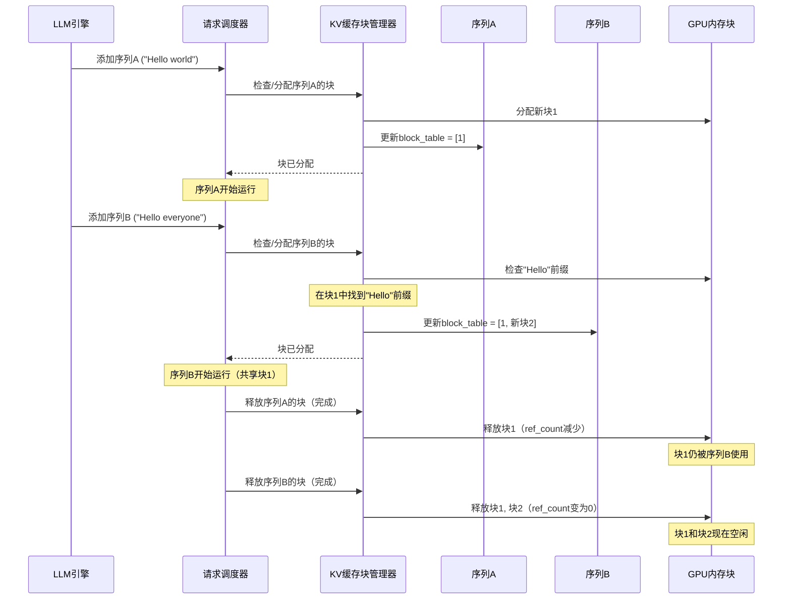

# 第4章：KV缓存块管理器

在[第3章：请求调度器](03_request_scheduler_.md)中，我们看到了请求调度器如何扮演空中交通管制员的角色，决定哪些文本生成请求（我们的`Sequence`对象）可以在GPU上运行

调度器工作的一个重要部分是确保"跑道"（GPU内存）上有足够的空间容纳所有"飞机"（序列）。这种宝贵的GPU内存中最贪婪的乘客之一就是**键值（KV）缓存**。

这就是**KV缓存块管理器**的用武之地

想象你有一本非常特殊的高速笔记本，AI模型在其中存储处理先前单词的"短期记忆"。这本笔记本速度极快，但页数有限。KV缓存块管理器就像是这本特殊笔记本的专家图书管理员。它确保每个文本生成请求高效地获取所需的页面，甚至在多个请求共享相同开头时重复使用页面。

## 它解决了什么问题？

当大型语言模型（LLM）生成文本时，它会逐个处理标记。为了决定下一个单词，它需要"记住"当前对话中的所有先前单词。这种记忆存储在**键值（KV）缓存**中。

可以这样理解：
* **键**：单词在其上下文中的含义==摘要==（它携带的信息）。
* **值**：与该单词关联的实际"==记忆=="或特征。

每次模型处理一个标记时，都会为其计算一个新的"键"和"值"，并将它们添加到KV缓存中。例如，如果你问"给我讲一个关于勇敢骑士的故事"，在处理"给我"、"讲"、"一个"、"关于"、"勇敢"、"骑士"之后，KV缓存将保存所有这些标记的键和值。

当模型需要生成下一个单词时，它会将"骑士"的键与所有先前的键进行==比较==，以决定接下来要说什么。

为*每个正在进行的请求*的*每个标记*存储这些键和值会迅速消耗大量GPU内存。如果没有智能的管理器，内存很快就会耗尽，限制你的AI可以同时处理的对话数量。

KV缓存块管理器通过以下方式解决这个问题：
1. **高效分配**：它将GPU内存分割成固定大小的小块（块），并根据需要分配给序列。
2. **内存重用（前缀缓存）**：如果多个请求以完全相同的短语开头（例如"给我讲一个关于..."），管理器会==重用该共享前缀的KV缓存块，节省大量内存==。
3. **动态管理**：随着序列的增长分配新块，并在序列完成或暂停时释放它们。

## KV缓存管理的核心概念

让我们分解使KV缓存管理高效的核心思想：

### 1. KV缓存（键和值）

如前所述，对于序列中的每个标记，模型计算一个"键"和一个"值"。这些是捕捉标记含义和上下文的数值表示。它们对自注意力机制至关重要，允许模型在生成新标记时关注相关的过去信息。将它们存储在KV缓存中意味着模型不必为每个新标记从头重新计算它们，从而大大加快文本生成速度。

### 2. 内存块

KV缓存块管理器不是逐个标记分配内存（效率低下），而是将预留用于KV缓存的总GPU内存划分为**固定大小的块**。

* 想象一本大笔记本（GPU内存）有许多空白页。每页是一个"块"。
* 一个块可以存储特定数量标记的KV缓存（例如256个标记）。这是`block_size`。

这种基于块的方法简化了内存管理。当[生成序列](02_generation_sequence_.md)需要内存时，它会请求一个或多个块，而不是请求精确的标记大小块。

### 3. 块表（针对一个序列）

每个单独的[生成序列](02_generation_sequence_.md)需要知道大笔记本中哪些块属于它。它使用**块表**来跟踪这一点。

* **块表**只是一个`block_id`列表（如页码），存储*该特定序列*的KV缓存。
* 当序列生成更多标记时，它可能需要更多块，其块表会更新。

| 序列标记索引 | 示例块表                    | 类比（页码） |
| :----------- | :-------------------------- | :----------- |
| 标记0-255    | `[块ID 5]`                  | 第5页        |
| 标记256-511  | `[块ID 5, 块ID 12]`         | 第5,12页     |
| 标记512-767  | `[块ID 5, 块ID 12, 块ID 3]` | 第5,12,3页   |

### 4. 前缀缓存（智能重用）

这是一个关键优化。如果你有两个请求：
1. "给我讲一个关于勇敢骑士的故事..."
2. "给我讲一个关于善良公主的故事..."

两个请求都以"给我讲一个关于"开头。这个共同前缀的KV缓存将是*相同的*。KV缓存块管理器使用一个巧妙的==技巧（哈希）来检测这些相同的前缀，并在多个序列之间**共享**它们的KV缓存块==。

* 如果`序列A`已经处理了"给我讲一个关于"并将其KV缓存在`块ID 5`中，那么当`序列B`出现相同前缀时，它也可以在其块表中指向`块ID 5`。
* 这显著减少了内存使用，因为相同的KV缓存数据不会在GPU上重复存储。

## KV缓存块管理器的工作原理

KV缓存块管理器（`BlockManager`）与[请求调度器](03_request_scheduler_.md)紧密合作。当调度器决定运行一个[生成序列](02_generation_sequence_.md)时，它首先咨询`BlockManager`以确保有足够的内存。

以下是简化流程：



### 内部机制：`BlockManager`类

KV缓存管理的核心逻辑位于`nanovllm/engine/block_manager.py`中的`BlockManager`类。

#### 初始化管理器

当[请求调度器](03_request_scheduler_.md)创建时，它会初始化`BlockManager`：

```python
# nanovllm/engine/scheduler.py (简化)
from nanovllm.engine.block_manager import BlockManager

class Scheduler:
    def __init__(self, config: Config):
        # ...
        # 创建我们的专家图书管理员！
        self.block_manager = BlockManager(config.num_kvcache_blocks, config.kvcache_block_size)
        # ...
```

`BlockManager`本身设置其内部状态：

```python
# nanovllm/engine/block_manager.py (简化)
from collections import deque

class Block:
    # 我们接下来会看到这个类！
    pass

class BlockManager:

    def __init__(self, num_blocks: int, block_size: int):
        self.block_size = block_size
        # 创建所有单独的"块"（笔记本中的页面）
        self.blocks: list[Block] = [Block(i) for i in range(num_blocks)]
        # 一个字典，用于通过内容哈希快速查找块（用于前缀缓存）
        self.hash_to_block_id: dict[int, int] = dict()
        # 队列用于跟踪空闲和已使用的块
        self.free_block_ids: deque[int] = deque(range(num_blocks))
        self.used_block_ids: set[int] = set()
```
这里，`num_blocks`是GPU上可用的KV缓存块总数，`block_size`是每个块可以容纳的标记数。`BlockManager`初始化一个`Block`对象列表，并设置队列来管理它们。

#### `Block`对象

我们KV缓存笔记本中的每个单独"页面"由一个`Block`对象表示：

```python
# nanovllm/engine/block_manager.py (简化)
class Block:
    def __init__(self, block_id):
        self.block_id = block_id      # 其唯一页码
        self.ref_count = 0            # 有多少序列在使用此块
        self.hash = -1                # 其内容的唯一标识符（用于前缀缓存）
        self.token_ids = []           # 此块中存储的实际标记ID（用于验证）

    def update(self, hash: int, token_ids: list[int]):
        # 当新内容存储在此块中时调用
        self.hash = hash
        self.token_ids = token_ids

    def reset(self):
        # 当块被分配用于新内容时调用
        self.ref_count = 1 # 从一个用户开始
        self.hash = -1
        self.token_ids = []
```
`ref_count`对前缀缓存至关重要：如果多个序列共享一个块，其`ref_count`将大于1。只有当`ref_count`降至0时，块才真正可以重用。

#### 分配块（`allocate`）

当[生成序列](02_generation_sequence_.md)需要内存（无论是初始提示还是生成新标记）时，`请求调度器`调用`block_manager.allocate(seq)`。

```python
# nanovllm/engine/block_manager.py (简化)
class BlockManager:
    # ...
    def compute_hash(self, token_ids: list[int], prefix: int = -1):
        # 为一块标记生成唯一的"指纹"。
        # 如果提供了'prefix'，它会为链式块组合哈希。
        # 这就是前缀缓存的工作原理！
        h = xxhash.xxh64()
        if prefix != -1:
            h.update(prefix.to_bytes(8, "little"))
        h.update(np.array(token_ids).tobytes())
        return h.intdigest()

    def allocate(self, seq: Sequence):
        h = -1 # 跟踪哈希以链式块（前缀缓存）
        cache_miss = False
        for i in range(seq.num_blocks): # 遍历序列所需的每个块
            token_ids_for_block = seq.block(i) # 获取此块的标记
            # 计算前缀缓存的哈希
            h = self.compute_hash(token_ids_for_block, h) if len(token_ids_for_block) == self.block_size else -1

            block_id = self.hash_to_block_id.get(h, -1) # 尝试找到现有块
            if block_id == -1 or self.blocks[block_id].token_ids != token_ids_for_block:
                cache_miss = True # 未找到块或内容不匹配
            
            if cache_miss:
                # 如果没有现有块，获取一个空闲块
                block_id = self.free_block_ids[0]
                block = self._allocate_block(block_id) # 标记为已使用
            else:
                # 如果存在匹配块，重用它！
                seq.num_cached_tokens += self.block_size
                block = self.blocks[block_id]
                block.ref_count += 1 # 增加引用计数
            
            if h != -1:
                block.update(h, token_ids_for_block)
                self.hash_to_block_id[h] = block_id # 存储或更新哈希映射
            
            seq.block_table.append(block_id) # 将块添加到序列的表中
```
这个`allocate`方法是前缀缓存的核心。它尝试将当前标记块与先前存储的块通过其`hash`匹配。如果找到匹配，则增加`ref_count`并重用该块。否则，分配一个新的`Block`。

#### 释放块（`deallocate`）

当[生成序列](02_generation_sequence_.md)完成或被抢占时，`请求调度器`调用`block_manager.deallocate(seq)`以释放其内存。

```python
# nanovllm/engine/block_manager.py (简化)
class BlockManager:
    # ...
    def deallocate(self, seq: Sequence):
        for block_id in reversed(seq.block_table): # 反向遍历块
            block = self.blocks[block_id]
            block.ref_count -= 1 # 减少引用计数
            if block.ref_count == 0:
                self._deallocate_block(block_id) # 如果没有其他人在使用它，释放它
        seq.num_cached_tokens = 0
        seq.block_table.clear() # 清空序列的块表
```
`deallocate`减少每个块的`ref_count`。只有当块的`ref_count`降至零（意味着没有序列在使用它）时，块才真正返回到`free_block_ids`池。

#### 与`Attention`层的交互

最终，`BlockManager`管理的KV缓存块被实际的神经网络层使用，特别是`Attention`层。`Attention`层需要知道在哪里读取和写入键和值。

```python
# nanovllm/layers/attention.py (简化)
import torch
from nanovllm.utils.context import get_context

class Attention(nn.Module):
    # ...
    def forward(self, q: torch.Tensor, k: torch.Tensor, v: torch.Tensor):
        context = get_context() # 访问全局推理上下文
        k_cache, v_cache = self.k_cache, self.v_cache # 这些保存整个GPU KV缓存内存

        if k_cache.numel() and v_cache.numel():
            # 使用slot_mapping将新计算的k, v存储到主KV缓存中
            store_kvcache(k, v, k_cache, v_cache, context.slot_mapping)
        
        if context.is_prefill:
            # 对于预填充，如果前缀缓存激活，直接使用k_cache, v_cache
            if context.block_tables is not None:
                k, v = k_cache, v_cache # 使用缓存值
            # flash_attn_varlen_func使用block_tables知道读取哪些内存块
            o = flash_attn_varlen_func(q, k, v, block_table=context.block_tables)
        else: # 解码（逐个生成标记）
            # flash_attn_with_kvcache使用block_table读取过去的标记并写入当前标记
            o = flash_attn_with_kvcache(q.unsqueeze(1), k_cache, v_cache, block_table=context.block_tables)
        return o
```
`Attention`层接收`k_cache`和`v_cache`，它们是表示KV缓存的*整个池*的大张量。关键的是，`context.slot_mapping`和`context.block_tables`（由[模型运行器](05_model_runner_.md)使用`BlockManager`的信息准备）告诉`Attention`层在该大池中*确切位置*读取和写入每个序列每个标记的KV缓存数据。这就是`BlockManager`中的抽象`block_id`如何转换为GPU上的具体内存位置。

## 结论

**KV缓存块管理器**是`nano-vllm`中一个重要而复杂的组件。

它是模型短期记忆（KV缓存）的专家图书管理员，确保有限的GPU内存被高效分配、重用和释放。通过将内存分割为固定大小的块，用引用计数跟踪它们的使用情况，并巧妙地重用共同前缀，它使[LLM引擎](01_llm_engine_.md)能够处理许多并发的文本生成请求而不会耗尽资源。这种智能的内存管理是实现高吞吐量和降低推理成本的关键因素。

你现在已经了解了请求如何被调度以及它们的内存如何被管理。在下一章中，我们将看看[模型运行器](05_model_runner_.md)，它是负责==将这些调度的请求实际送入AI模型==以生成新标记的组件。

[模型运行器](05_model_runner_.md)

