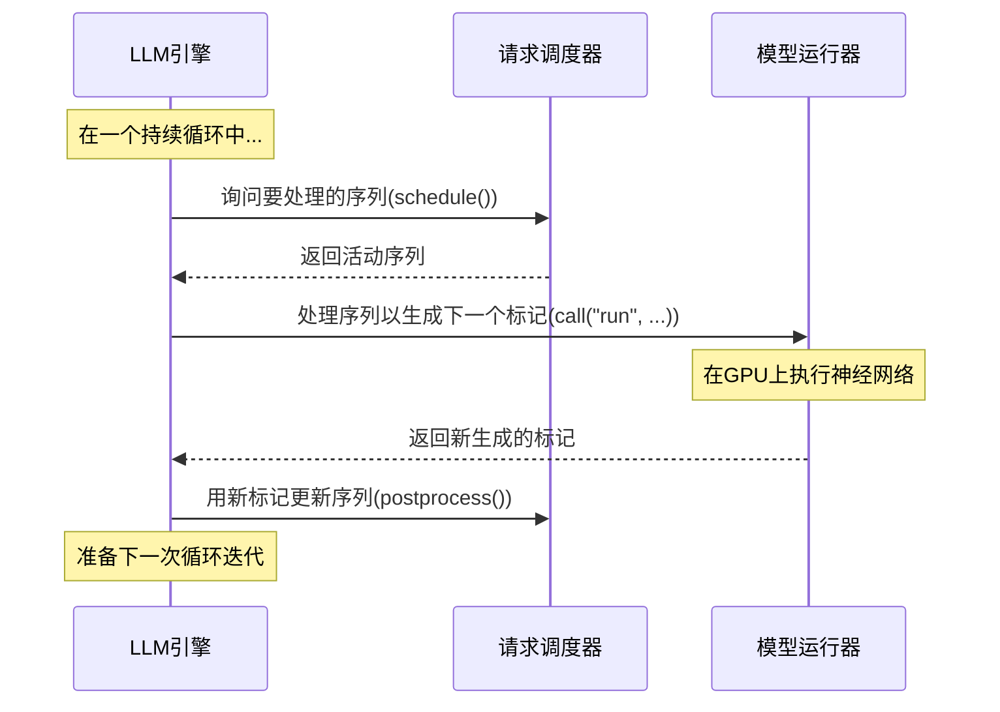

# 第5章：模型运行器

在[第3章：请求调度器](03_request_scheduler_.md)中，我们了解了请求调度器如何高效组织和优先处理文本生成请求（我们的`Sequence`对象）。接着，在[第4章：KV缓存块管理器](04_kv_cache_block_manager_.md)中，我们看到了GPU内存（尤其是KV缓存）是如何被巧妙管理以确保所有请求都有所需的空间。

现在，我们的请求已经排好队，内存也已准备就绪。那么，谁来做这些繁重的计算工作？谁负责==执行==那些让大型语言模型（LLM）生成文本的极其复杂的==计算==？

这就是**模型运行器**的工作！

将我们的`nano-vllm`系统想象成一个高科技汽车工厂：
* [LLM引擎](01_llm_engine_.md)是工厂的总负责人。
* [请求调度器](03_request_scheduler_.md)是生产线主管，决定接下来生产哪些汽车。
* [KV缓存块管理器](04_kv_cache_block_manager_.md)是零件管理员，确保所有必要的组件都可用。
* **模型运行器**是装配线上的专业机器人或工人，实际*组装零件*、*焊接框架*和*喷涂车身*。它是执行核心制造任务的工人——==在GPU上进行实际的神经网络计算以生成标记==。

## 它解决了什么问题？

运行像LLM这样强大的AI模型需求极高。它涉及：
1. **加载庞大模型**：LLM可能有数十亿参数（权重），需要加载到GPU内存中。
2. **复杂计算**：通过神经网络执行"前向传递"（输入并获取输出的过程）涉及数百万甚至数十亿次数学运算。
3. **GPU内存管理**：除了KV缓存，模型本身和中间计算也会消耗大量GPU内存。
4. **速度**：这些计算需要尽可能快地完成，以便为用户提供快速响应，尤其是在同时处理多个请求时。
5. **多GPU协调**：对于非常大的模型或极高的吞吐量，模型可能分布在多个GPU上，需要仔细协调。

模型运行器是一个专用工作组件，通过负责神经网络的实际GPU加速执行来解决所有这些问题。

## 模型运行器的关键职责

模型运行器就像是工厂车间里高效的专业工人，有几项关键职责：
* **模型加载**：它将整个AI模型的参数（权重）加载到其运行的GPU上。
* **GPU执行**：它执行实际的"前向传递"计算，接收输入标记并生成模型对下一个标记的预测。
* **KV缓存交互**：它读取和写入[KV缓存块管理器](04_kv_cache_block_manager_.md)分配的KV缓存块。
* **使用CUDA图优化**：它使用CUDA图等高级技术"预记录"GPU操作序列，从而可以更快地重放它们。
* **分布式处理**：如果配置为使用多个GPU（张量并行），每个模型运行器处理其分配的部分模型并与其他模型运行器协调。

## LLM引擎如何使用模型运行器

就像不会直接与装配线上的机器人交谈一样，也不会直接与模型运行器交互。它是[LLM引擎](01_llm_engine_.md)协调的内部组件。

让我们再看一下[第1章：LLM引擎](01_llm_engine_.md)中的主循环，重点关注`ModelRunner`的角色：


在文本生成的每个周期中，[LLM引擎](01_llm_engine_.md)从[请求调度器](03_request_scheduler_.md)获取一批序列，然后通过调用其`run`方法将它们交给模型运行器。模型运行器随后使用其GPU能力为所有这些序列计算下一个标记，并将它们返回给[LLM引擎](01_llm_engine_.md)。

## 内部机制：`ModelRunner`类

模型运行器的实现位于`nanovllm/engine/model_runner.py`中的`ModelRunner`类。它是一个繁忙的组件！

### 初始化（`__init__`）

当[LLM引擎](01_llm_engine_.md)启动时，它会创建一个或多个`ModelRunner`实例。主要的`ModelRunner`（用于GPU 0）与在单独进程中运行在其他GPU上的其他`ModelRunner`实例协调。

```python
# nanovllm/engine/model_runner.py (简化)
import torch.distributed as dist
from nanovllm.config import Config
from nanovlllm.models.qwen3 import Qwen3ForCausalLM # 我们的AI模型！
from nanovllm.utils.loader import load_model

class ModelRunner:
    def __init__(self, config: Config, rank: int, event):
        self.config = config
        self.rank = rank # 此运行器使用的GPU编号（0, 1, 2...）
        self.world_size = config.tensor_parallel_size # GPU总数

        # 1. 如果使用多个GPU，设置分布式通信
        dist.init_process_group("nccl", "tcp://localhost:2333", world_size=self.world_size, rank=rank)
        torch.cuda.set_device(rank) # 将此运行器分配给特定GPU
        
        # 2. 将实际AI模型加载到GPU上
        self.model = Qwen3ForCausalLM(config.hf_config) # 创建模型结构
        load_model(self.model, config.model) # 加载训练好的权重
        
        # 3. 准备快速执行
        self.warmup_model() # 进行小规模测试运行以准备
        self.allocate_kv_cache() # 保留主KV缓存内存
        if not config.enforce_eager:
            self.capture_cudagraph() # 记录GPU操作以提高速度
```
在这个`__init__`方法中：
1. **分布式设置**：如果使用多个GPU，它会设置`torch.distributed`，确保`ModelRunner`实例可以通信。每个`ModelRunner`被分配一个`rank`（其GPU ID）。
2. **模型加载**：它创建`Qwen3ForCausalLM`（我们的特定AI模型）的实例，然后使用`load_model`（来自`nanovllm/utils/loader.py`）将模型的实际训练数值权重加载到GPU上。
3. **优化**：它调用`warmup_model`、`allocate_kv_cache`和`capture_cudagraph`。这些是让模型准备好进行超快速推理的关键步骤。

#### 预热和分配KV缓存

`warmup_model`执行一个虚拟运行以确保一切准备就绪，`allocate_kv_cache`为KV缓存预留一大块GPU内存。

```python
# nanovllm/engine/model_runner.py (简化)
# ...
class ModelRunner:
    # ...
    def warmup_model(self):
        # 通过模型运行一个小型虚拟序列以准备一切。
        # 这有助于预分配一些内部缓冲区并使GPU准备好。
        # （简化：通常创建一个虚拟序列并调用self.run）
        print(f"ModelRunner {self.rank}: Warming up model...")

    def allocate_kv_cache(self):
        config = self.config
        # 计算有多少GPU内存可用，并确定可以创建多少KV缓存块。
        # 然后将此内存分配为k_cache和v_cache的大张量。
        self.kv_cache = torch.empty(
            2, # 用于K和V
            config.hf_config.num_hidden_layers, # 每层有自己的KV缓存
            config.num_kvcache_blocks, # KV缓存块管理器管理的总块数
            self.block_size, # 每块的标记数
            # ... 头和头维度的维度 ...
        ).cuda() # 在GPU上分配

        layer_id = 0
        for module in self.model.modules():
            # 将大'kv_cache'张量的切片分配给每个注意力层。
            # 这是实际模型层获取KV缓存内存的方式。
            if hasattr(module, "k_cache") and hasattr(module, "v_cache"):
                module.k_cache = self.kv_cache[0, layer_id]
                module.v_cache = self.kv_cache[1, layer_id]
                layer_id += 1
        print(f"ModelRunner {self.rank}: KV Cache allocated with {config.num_kvcache_blocks} blocks.")
```
`allocate_kv_cache`方法非常重要。它动态确定GPU上有多少内存可以专用于KV缓存，然后分配一个单一的大张量（`self.kv_cache`）。然后，它巧妙地将此张量的特定切片分配给模型中每个注意力层的`k_cache`和`v_cache`属性。这意味着所有注意力层共享这个共同的KV缓存内存池。

#### 使用CUDA图实现最大速度

CUDA图是一项强大的NVIDIA技术，用于加速重复的GPU计算。

CUDA图不是每次向GPU发送单独的指令，而是==记录一系列操作，然后作为一个高度优化的单元"重放"它们==。

这显著减少了开销，并使模型运行得更快，尤其是在逐个生成标记（解码阶段）时。

```python
# nanovllm/engine/model_runner.py (简化)
# ...
class ModelRunner:
    # ...
    @torch.inference_mode()
    def capture_cudagraph(self):
        # 创建具有最大可能大小的虚拟输入张量，
        # 并运行模型一次以"记录"GPU操作。
        # 这个记录的序列（"图"）可以非常快速地重放。
        # 捕获多个图以覆盖常见场景的不同批量大小。
        print(f"ModelRunner {self.rank}: Capturing CUDA Graphs...")
        # （简化：实际代码涉及不同批量大小的循环）
        dummy_input_ids = torch.zeros(1, dtype=torch.int64).cuda()
        dummy_positions = torch.zeros(1, dtype=torch.int64).cuda()
        
        # set_context准备模型层将使用的全局变量
        from nanovllm.utils.context import set_context
        set_context(False, slot_mapping=torch.zeros(1, dtype=torch.int32).cuda(),
                    context_lens=torch.zeros(1, dtype=torch.int32).cuda(),
                    block_tables=torch.zeros(1, 1, dtype=torch.int32).cuda())

        graph = torch.cuda.CUDAGraph()
        with torch.cuda.graph(graph):
            _ = self.model(dummy_input_ids, dummy_positions) # 记录操作

        self.graphs = {1: graph} # 存储捕获的图
        # 其他设置以重放这些图
        
        from nanovllm.utils.context import reset_context
        reset_context()
        print(f"ModelRunner {self.rank}: CUDA Graphs captured.")
```
`capture_cudagraph`方法将模型的前向传递记录到一个图中。当模型需要生成一个标记时，只需"重放"此图，避免了重复编译指令的开销。

### `run`方法：执行模型

这是模型运行器的主要入口点，由[LLM引擎](01_llm_engine_.md)调用以生成标记。

```python
# nanovllm/engine/model_runner.py (简化)
from nanovllm.engine.sequence import Sequence
from nanovllm.utils.context import set_context, reset_context

class ModelRunner:
    # ...
    def run(self, seqs: list[Sequence], is_prefill: bool) -> list[int]:
        # 1. 为模型准备输入数据
        if is_prefill:
            input_ids, positions = self.prepare_prefill(seqs) # 用于处理完整提示
        else:
            input_ids, positions = self.prepare_decode(seqs) # 用于生成单个标记

        # 2. 获取模型的输出（logits）
        logits = self.run_model(input_ids, positions, is_prefill)

        # 3. 采样下一个标记（如果这是主GPU）
        token_ids = None
        if self.rank == 0: # 只有主GPU处理采样
            from nanovllm.layers.sampler import Sampler
            sampler = Sampler() # 简化：Sampler实际上初始化一次
            temperatures = self.prepare_sample(seqs)
            token_ids = sampler(logits, temperatures).tolist()
        
        reset_context() # 清除下一个步骤的全局上下文
        return token_ids
```
`run`方法协调核心推理过程：
1. **准备数据**：它调用`prepare_prefill`或`prepare_decode`从`Sequence`对象中收集所有必要的输入数据（如`input_ids`、`positions`、`slot_mapping`和`block_tables`）。这些函数还使用`set_context`（来自`nanovllm/utils/context.py`）使这些数据对模型层全局可访问。
2. **运行模型**：然后调用`run_model`在GPU上实际执行神经网络，返回`logits`（下一个标记的原始预测）。
3. **采样标记**：如果此`ModelRunner`在主GPU上（`rank == 0`），它使用`Sampler`将这些`logits`转换为实际的`token_ids`，通常受[生成序列](02_generation_sequence_.md)中的`SamplingParams`（如`temperature`）影响。

#### 为模型准备数据

`prepare_prefill`和`prepare_decode`方法对于将`Sequence`对象转换为底层神经网络期望的特定张量至关重要。它们还设置全局推理`Context`。

```python
# nanovllm/engine/model_runner.py (简化)
# ...
from nanovllm.utils.context import set_context

class ModelRunner:
    # ...
    def prepare_prefill(self, seqs: list[Sequence]):
        input_ids = []
        positions = []
        slot_mapping = [] # 存储新标记的K/V的位置
        block_tables = None # 如果前缀缓存，指向KV缓存块
        
        for seq in seqs:
            # 收集所有提示标记及其位置
            input_ids.extend(seq.token_ids[seq.num_cached_tokens:])
            positions.extend(list(range(seq.num_cached_tokens, len(seq.token_ids))))
            
            # 将标记映射到KV缓存中的确切内存槽
            # （使用KV缓存块管理器中的block_table）
            for i in range(seq.num_cached_blocks, seq.num_blocks):
                # 计算块中每个标记的精确槽
                start_slot = seq.block_table[i] * self.block_size 
                slot_mapping.extend(list(range(start_slot, start_slot + self.block_size))) # 简化
        
        # 将列表转换为GPU张量
        input_ids = torch.tensor(input_ids).cuda(non_blocking=True)
        positions = torch.tensor(positions).cuda(non_blocking=True)
        slot_mapping = torch.tensor(slot_mapping).cuda(non_blocking=True)
        block_tables = self.prepare_block_tables(seqs) # 为注意力层准备块表
        
        # 将所有数据存储在全局推理上下文中
        set_context(True, slot_mapping=slot_mapping, block_tables=block_tables,
                    # ... 其他上下文变量如cu_seqlens_q, max_seqlen_q ...
                    )
        return input_ids, positions

    def prepare_decode(self, seqs: list[Sequence]):
        input_ids = []
        positions = []
        slot_mapping = [] # 存储单个新标记的K/V的位置
        context_lens = [] # 序列当前长度
        
        for seq in seqs:
            # 对于解码，我们只传递每个序列的*最后一个*标记
            input_ids.append(seq.last_token)
            positions.append(len(seq) - 1)
            context_lens.append(len(seq))
            # 将新标记映射到KV缓存中的特定槽
            slot_mapping.append(seq.block_table[-1] * self.block_size + seq.last_block_num_tokens - 1)
        
        # 将列表转换为GPU张量
        input_ids = torch.tensor(input_ids).cuda(non_blocking=True)
        positions = torch.tensor(positions).cuda(non_blocking=True)
        slot_mapping = torch.tensor(slot_mapping).cuda(non_blocking=True)
        context_lens = torch.tensor(context_lens).cuda(non_blocking=True)
        block_tables = self.prepare_block_tables(seqs)
        
        # 将数据存储在全局上下文中，标记为解码阶段
        set_context(False, slot_mapping=slot_mapping, context_lens=context_lens, block_tables=block_tables)
        return input_ids, positions
```
这些`prepare_`方法非常关键。它们获取`Sequence`对象的当前状态，并将它们打包成神经网络模型期望的张量。它们还使用`set_context`将重要信息（如`slot_mapping`，告诉模型在`kv_cache`中存储其键和值的确切位置）传递给底层神经网络层。这个`Context`（来自`nanovllm/utils/context.py`）就像一个共享的黑板，`ModelRunner`在其中为层写入指令。

#### 运行模型（使用CUDA图）

最后，`run_model`执行实际的神经网络，智能地决定是使用CUDA图还是直接运行模型（急切执行）。

```python
# nanovllm/engine/model_runner.py (简化)
# ...
from nanovllm.utils.context import get_context

class ModelRunner:
    # ...
    @torch.inference_mode()
    def run_model(self, input_ids: torch.Tensor, positions: torch.Tensor, is_prefill: bool):
        if is_prefill or self.enforce_eager or input_ids.size(0) > 512:
            # 对于预填充或禁用CUDA图或批量过大，
            # 直接运行模型（急切执行）。
            return self.model.compute_logits(self.model(input_ids, positions))
        else:
            # 对于解码阶段且启用CUDA图，
            # 重放预录制的图以获得最大速度。
            context = get_context() # 获取prepare_decode准备的上下文
            graph_vars = self.graph_vars # 链接到捕获图的变量
            
            # 将当前输入数据复制到图的预分配张量中
            graph_vars["input_ids"][:input_ids.size(0)] = input_ids
            graph_vars["positions"][:input_ids.size(0)] = positions
            graph_vars["slot_mapping"][:input_ids.size(0)] = context.slot_mapping
            graph_vars["context_lens"][:input_ids.size(0)] = context.context_lens
            graph_vars["block_tables"][:input_ids.size(0), :context.block_tables.size(1)] = context.block_tables
            
            self.graphs[input_ids.size(0)].replay() # 执行记录的图！
            return self.model.compute_logits(graph_vars["outputs"][:input_ids.size(0)])
```
`run_model`方法是AI模型真正活跃的地方。它使用`input_ids`和`positions`输入`self.model()`。如果是"解码"阶段（生成一个标记）且启用了CUDA图，它会巧妙地将当前输入数据复制到特殊的预分配张量中，然后`replay()`先前捕获的CUDA图。这是`nano-vllm`速度优化的主要手段之一！

## 结论

**模型运行器**是`nano-vllm`的动力源，是让AI模型活跃起来的专用工人。它负责将庞大的模型权重加载到GPU上，执行复杂的神经网络计算，并管理与KV缓存的交互。关键的是，它==采用了CUDA图等高级优化，并支持跨多个GPU的分布式处理==，以确保文本生成尽可能快速高效。

现在已经了解了模型运行器如何获取准备好的请求并==实际运行AI模型以生成新标记==。

但`self.model`内部是什么？在下一章中，我们将打开黑匣子，深入探讨构成大型语言模型的[神经网络层](06_neural_network_layers_.md)。

[神经网络层](06_neural_network_layers_.md)

