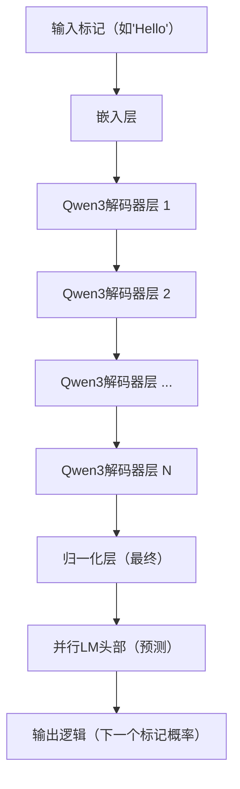
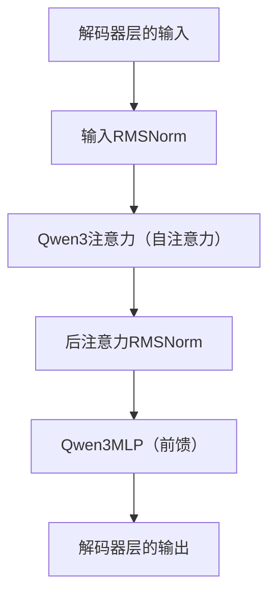

# 第6章：神经网络层

在[第5章：模型运行器](05_model_runner_.md)中，我们了解到模型运行器是如何接收请求、准备数据并将其输入实际的AI模型以生成新标记的

> 这个"AI模型"（`ModelRunner`中的`self.model`）是由什么组成的？它如何执行这些复杂的计算来理解语言并生成响应？

这就是**神经网络层**的用武之地

想象一个庞大且高度专业化的工厂，信息（如你的提示）流入，经过处理，然后新的信息（生成的文本）流出。这个工厂不仅仅是一台巨型机器，而是==由许多不同的专业部门组成==，每个部门都有非常具体的任务。这些"部门"就是神经网络层。

## 它们解决了什么问题？

大型语言模型（LLM）需要执行极其复杂的任务：理解人类语言的细微差别、识别模式、生成语法正确的句子，甚至具有创造性。没有任何单一、简单的计算可以实现所有这些。

相反，LLM将这个巨大任务分解为许多更小、可管理的步骤。每个**神经网络层**负责其中一个步骤。通过将数百甚至数千个这些专业层链接在一起，模型可以逐步将原始文本转化为深层含义，然后再转化为连贯的新文本。

可以将其想象为搭建乐高杰作：
* 你不仅仅有一个巨大的乐高积木。
* 你有许多不同类型的积木：扁平的、高的、有凸点的、有孔的。
* 每个积木（层）都有特定的形状和功能。
* 你按特定顺序堆叠和连接这些积木，以构建出惊人的东西（LLM）。


> 这些层是基本的构建块。它们使模型能够：

* **处理信息**：每层执行一个计算，细化或转换其接收到的数据。
* **学习复杂模式**：通过组合许多简单操作，网络可以学习语言中非常复杂的关系。
* **扩展**：只需添加更多层，就可以使模型更强大，使"工厂"更深。

## 神经网络层的关键类型

虽然LLM包含许多类型的层，但以下是一些最常见和重要的类型，尤其是在`nano-vllm`使用的Qwen3等模型中：

| 层类型              | 类比                | 功能                                                         |
| :------------------ | :------------------ | :----------------------------------------------------------- |
| **嵌入层**          | 翻译器 / 字典       | 将单词（标记）==转换==为模型可以理解的数字（向量）。这是第一步 |
| **线性（投影）**    | 调整大小 / 重塑工具 | 将数据从一个维度转换到另一个维度。通常用于将数据==投影==到不同的"空间"或组合信息。 |
| **注意力**          | 聚光灯 / 焦点小组   | 帮助模型决定输入的哪些部分（或先前的标记）对于理解当前==标记==或生成下一个标记最重要。 |
| **归一化**          | 音量控制 / 稳定器   | 调整数据的==规模==以保持计算稳定，并帮助模型更有效地学习（如保持信号水平一致）。 |
| **激活函数**        | 决策者 / 过滤器     | ==引入非线性==，使模型能够学习超出简单直线的更复杂关系。     |
| **前馈网络（MLP）** | 智囊团 / 数据处理器 | 由线性层和激活函数组成的块，允许模型"==思考=="信息并进一步转换它。 |

## 层如何构成LLM：以Qwen3为例

在`nano-vllm`中，我们经常提到`Qwen3ForCausalLM`模型。这个模型是通过以特定架构组合许多这些层构建的。让我们看看它们是如何堆叠的。

### 整体概览

LLM通常从嵌入层开始，通过许多重复的"解码器层"处理信息，最后是一个"头部"层来预测下一个标记。


此图展示了整体流程：
1.  **嵌入层**：将你的`input_ids`（数字标记）转换为初始数字表示（`hidden_states`）。
2.  **Qwen3解码器层（重复）**：这是核心"思考"单元。典型的LLM会有*许多*这样的层堆叠在一起（例如Qwen3-0.6B有32层！）。每层处理来自前一层的信息，建立更深的理解。
3.  **最终归一化**：在所有处理完成后稳定输出的层。
4.  **并行LM头部**：这是"预测"层。它将最终处理的数字数据转换回词汇表中每个可能的下一个单词的概率。

### 深入`Qwen3DecoderLayer`

魔法主要发生在每个`Qwen3DecoderLayer`内部。这个单一层本身是一个迷你工厂，结合了几种基本层类型：


在每个`Qwen3DecoderLayer`内部：
1.  **输入RMSNorm**：一个[归一化层](#key-types-of-neural-network-layers)用于准备传入数据。
2.  **Qwen3注意力**：这是关键的[注意力层](#key-types-of-neural-network-layers)。它允许模型"回顾"序列中的所有先前标记，并决定哪些与当前标记最相关。
3.  **后注意力RMSNorm**：注意力机制后的另一个[归一化层](#key-types-of-neural-network-layers)。
4.  **Qwen3MLP**：一个[前馈网络](#key-types-of-neural-network-layers)，对数据进行更一般的处理和转换。

这些组件按顺序工作，在数据通过层的每个部分时细化`hidden_states`。一层的输出成为下一层的输入，逐步构建对文本的深层表示。

## 内部机制：层的代码

让我们看看`nano-vllm`中的一些简化代码，了解这些层在Python中是如何表示的。记住，这些都是高度优化的组件，通常利用GPU特定的操作。

### 顶层模型：`Qwen3ForCausalLM`

这是`ModelRunner`交互的类。它将所有内容整合在一起。

```python
# nanovllm/models/qwen3.py
import torch
from torch import nn
# ... 其他层的导入 ...

class Qwen3ForCausalLM(nn.Module):
    def __init__(self, config: Qwen3Config):
        super().__init__()
        self.model = Qwen3Model(config) # LLM的主体
        self.lm_head = ParallelLMHead(config.vocab_size, config.hidden_size) # 预测层
        if config.tie_word_embeddings:
            self.lm_head.weight.data = self.model.embed_tokens.weight.data

    def forward(self, input_ids: torch.Tensor, positions: torch.Tensor) -> torch.Tensor:
        # 通过Qwen3Model的主要前向传递
        return self.model(input_ids, positions)

    def compute_logits(self, hidden_states: torch.Tensor) -> torch.Tensor:
        # 获取预测概率的最后一步
        return self.lm_head(hidden_states)
```
*   `__init__`：设置核心`Qwen3Model`（解码器层的堆栈）和`lm_head`（最终的预测层）。
*   `forward`：当`ModelRunner`调用`self.model(input_ids, positions)`时，此方法简单地将`input_ids`和`positions`传递给`self.model`。
*   `compute_logits`：在`Qwen3Model`完成其工作后，此方法使用`self.lm_head`将最终的`hidden_states`转换为`logits`（每个可能的下一个标记的原始分数）。

### 主体模型：`Qwen3Model`

此类处理初始嵌入，然后堆叠所有`Qwen3DecoderLayer`。

```python
# nanovllm/models/qwen3.py
class Qwen3Model(nn.Module):
    def __init__(self, config: Qwen3Config):
        super().__init__()
        # 初始层：将标记ID转换为数字嵌入
        self.embed_tokens = VocabParallelEmbedding(config.vocab_size, config.hidden_size)
        # 模型的核心：许多解码器层的列表
        self.layers = nn.ModuleList([Qwen3DecoderLayer(config) for _ in range(config.num_hidden_layers)])
        # 最终归一化层
        self.norm = RMSNorm(config.hidden_size, eps=config.rms_norm_eps)

    def forward(self, input_ids: torch.Tensor, positions: torch.Tensor) -> torch.Tensor:
        # 1. 将输入标记转换为嵌入
        hidden_states = self.embed_tokens(input_ids)
        residual = None # 用于"残差连接"，有助于稳定训练

        # 2. 依次通过每个解码器层
        for layer in self.layers:
            hidden_states, residual = layer(positions, hidden_states, residual)
        
        # 3. 应用最终归一化
        hidden_states, _ = self.norm(hidden_states, residual)
        return hidden_states
```
*   `embed_tokens`：这是**嵌入层**（[`VocabParallelEmbedding`](#nanovllm-layers-embed_head-py)）。它是第一步，将标记ID转换为丰富的数字表示。
*   `layers`：这是`Qwen3DecoderLayer`的列表。模型通过循环依次处理每层的数据。
*   `norm`：在`lm_head`进行预测之前的最终**归一化层**（[`RMSNorm`](#nanovllm-layers-layernorm-py)）。

### 核心处理单元：`Qwen3DecoderLayer`

这里是[注意力](#key-types-of-neural-network-layers)和[MLP](#key-types-of-neural-network-layers)的魔法发生的地方，包裹在[归一化](#key-types-of-neural-network-layers)中。

```python
# nanovllm/models/qwen3.py
class Qwen3DecoderLayer(nn.Module):
    def __init__(self, config: Qwen3Config) -> None:
        super().__init__()
        self.self_attn = Qwen3Attention( # 注意力层
            hidden_size=config.hidden_size,
            num_heads=config.num_attention_heads,
            num_kv_heads=config.num_key_value_heads,
            # ... 其他注意力特定参数 ...
        )
        self.mlp = Qwen3MLP( # 前馈网络
            hidden_size=config.hidden_size,
            intermediate_size=config.intermediate_size,
            hidden_act=config.hidden_act,
        )
        self.input_layernorm = RMSNorm(config.hidden_size, eps=config.rms_norm_eps) # 第一个归一化层
        self.post_attention_layernorm = RMSNorm(config.hidden_size, eps=config.rms_norm_eps) # 第二个归一化层

    def forward(self, positions: torch.Tensor, hidden_states: torch.Tensor, residual: torch.Tensor | None) -> tuple[torch.Tensor, torch.Tensor]:
        # 应用第一个归一化
        hidden_states, residual = self.input_layernorm(hidden_states, residual)
        # 执行自注意力
        hidden_states = self.self_attn(positions, hidden_states)
        # 应用第二个归一化
        hidden_states, residual = self.post_attention_layernorm(hidden_states, residual)
        # 通过MLP（前馈网络）
        hidden_states = self.mlp(hidden_states)
        return hidden_states, residual
```
注意`forward`方法清晰地展示了流程：归一化，然后注意力，然后是另一个归一化，然后是MLP。`residual`连接是帮助训练深度网络的重要技巧。

### `Qwen3Attention`内部

`Qwen3Attention`层负责计算`q`（查询）、`k`（键）和`v`（值）向量，应用旋转嵌入，然后执行实际的注意力计算。

```python
# nanovllm/models/qwen3.py
from nanovllm.layers.linear import QKVParallelLinear # 专门的线性层
from nanovllm.layers.rotary_embedding import get_rope # 用于位置信息
from nanovllm.layers.attention import Attention # 核心注意力实现

class Qwen3Attention(nn.Module):
    def __init__(self, hidden_size: int, num_heads: int, num_kv_heads: int, **kwargs) -> None:
        super().__init__()
        # 线性层将hidden_states投影到查询、键和值
        self.qkv_proj = QKVParallelLinear(
            hidden_size, self.head_dim, self.total_num_heads, self.total_num_kv_heads, bias=qkv_bias,
        )
        # 注意力输出的线性层
        self.o_proj = RowParallelLinear(self.total_num_heads * self.head_dim, hidden_size, bias=False)
        # 旋转位置嵌入，用于理解单词顺序
        self.rotary_emb = get_rope(self.head_dim, rotary_dim=self.head_dim, max_position=max_position, base=rope_theta)
        # 实际的FlashAttention计算（高度优化）
        self.attn = Attention(self.num_heads, self.head_dim, self.scaling, self.num_kv_heads)
        # Q和K的归一化
        self.q_norm = RMSNorm(self.head_dim, eps=rms_norm_eps)
        self.k_norm = RMSNorm(self.head_dim, eps=rms_norm_eps)

    def forward(self, positions: torch.Tensor, hidden_states: torch.Tensor) -> torch.Tensor:
        qkv = self.qkv_proj(hidden_states) # 将hidden_states投影到qkv
        q, k, v = qkv.split([self.q_size, self.kv_size, self.kv_size], dim=-1) # 分割为Q, K, V
        q = self.q_norm(q.view(-1, self.num_heads, self.head_dim)) # 归一化Q
        k = self.k_norm(k.view(-1, self.num_kv_heads, self.head_dim)) # 归一化K
        v = v.view(-1, self.num_kv_heads, self.head_dim)
        q, k = self.rotary_emb(positions, q, k) # 应用位置嵌入
        o = self.attn(q, k, v) # 执行核心注意力计算
        output = self.o_proj(o.flatten(1, -1)) # 将注意力输出投影回来
        return output
```
这是一个繁忙的层

使用多个**线性层**（[`QKVParallelLinear`](#nanovllm-layers-linear-py)和[`RowParallelLinear`](#nanovllm-layers-linear-py)）来转换数据，应用专门的**旋转嵌入层**（[`RotaryEmbedding`](#nanovllm-layers-rotary_embedding-py)）来注入位置信息，最后使用高度优化的`Attention`类来执行核心注意力机制。

关键的是，`self.attn`对象（`nanovllm.layers.attention.Attention`的实例）是与[KV缓存块管理器](04_kv_cache_block_manager_.md)交互的地方。正如我们在[第4章](04_kv_cache_block_manager_.md)中看到的，这个`Attention`层使用`context.slot_mapping`和`context.block_tables`来*精确知道*在大型KV缓存内存池中读取和写入键和值的位置。

### 前馈网络：`Qwen3MLP`

此层在注意力机制后增加了更多"思考"能力。

```python
# nanovllm/models/qwen3.py
from nanovllm.layers.linear import MergedColumnParallelLinear, RowParallelLinear
from nanovllm.layers.activation import SiluAndMul # 专门的激活函数

class Qwen3MLP(nn.Module):
    def __init__(self, hidden_size: int, intermediate_size: int, hidden_act: str) -> None:
        super().__init__()
        # 两个线性层（合并以提高效率）
        self.gate_up_proj = MergedColumnParallelLinear(hidden_size, [intermediate_size] * 2, bias=False)
        self.down_proj = RowParallelLinear(intermediate_size, hidden_size, bias=False)
        assert hidden_act == "silu"
        self.act_fn = SiluAndMul() # 激活函数

    def forward(self, x):
        gate_up = self.gate_up_proj(x)
        x = self.act_fn(gate_up) # 应用激活和乘法
        x = self.down_proj(x)
        return x
```
`Qwen3MLP`由几个**线性层**（[`MergedColumnParallelLinear`](#nanovllm-layers-linear-py)、[`RowParallelLinear`](#nanovllm-layers-linear-py)）和一个**激活函数**（`SiluAndMul`）组成。这种组合允许模型以非线性方式处理信息，这对于学习复杂模式至关重要。

### 归一化层：`RMSNorm`

此层有助于稳定训练和推理过程。

```python
# nanovllm/layers/layernorm.py
import torch
from torch import nn

class RMSNorm(nn.Module):
    def __init__(self, hidden_size: int, eps: float = 1e-6) -> None:
        super().__init__()
        self.eps = eps
        self.weight = nn.Parameter(torch.ones(hidden_size))

    @torch.compile # 此装饰器有助于优化函数
    def rms_forward(self, x: torch.Tensor) -> torch.Tensor:
        orig_dtype = x.dtype
        x = x.float() # 转换为浮点数进行计算
        var = x.pow(2).mean(dim=-1, keepdim=True) # 计算方差
        x.mul_(torch.rsqrt(var + self.eps)) # 归一化
        x = x.to(orig_dtype).mul_(self.weight) # 缩放并转换回来
        return x

    def forward(self, x: torch.Tensor, residual: torch.Tensor | None = None) -> torch.Tensor | tuple[torch.Tensor, torch.Tensor]:
        if residual is None:
            return self.rms_forward(x) # 常规归一化
        else:
            # 处理在归一化之前添加残差连接
            return self.add_rms_forward(x, residual)
```
`RMSNorm`层是一种**归一化层**，计算输入的均方根并使用它来归一化数据。这将数值保持在健康范围内，防止训练期间的"梯度爆炸"或推理期间的不稳定等问题。`@torch.compile`装饰器突出了`nano-vllm`用于在GPU上加速此计算的优化。

## 结论

现在已经看到了大型语言模型的基本构建块：**神经网络层**。

这些专业组件，如嵌入层、注意力层、线性层和归一化层，被精心堆叠在一起。每层对数据执行特定的转换，通过==链接数百个这样的层==，模型可以逐步处理你的输入文本，理解其含义，并生成连贯、智能的响应。`Model Runner`协调数据通过这些层的流动，使整个AI模型活跃起来。

在下一章中，我们将探讨[全局推理上下文](07_global_inference_context_.md)。

这是一个关键的"共享黑板"，`Model Runner`使用它==向所有这些不同的层传递重要的实时信息==（如每个序列的KV缓存数据的位置），确保它们为当前批次的请求正确执行计算。

[全局推理上下文](07_global_inference_context_.md)

