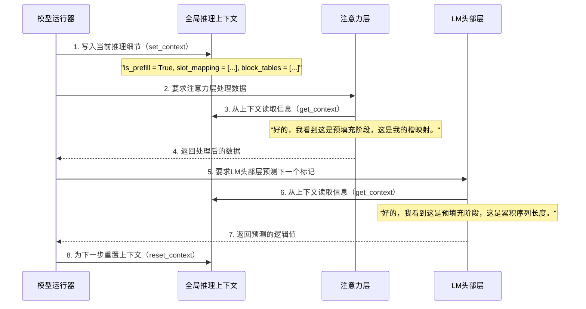

# 第7章：全局推理上下文

在[第6章：神经网络层](06_neural_network_layers_.md)中，我们探索了大型语言模型（LLM）的==各个构建模块==，如注意力层和MLP层。我们看到了[模型运行器](05_model_runner_.md)如何==引导==数据通过这些层来生成文本。

现在，想象你是一名指挥，领导一支大型管弦乐队。

每位音乐家（一个神经网络层）都需要知道当前曲目的速度、调性和具体指令。如果你必须为每个音符单独向每位音乐家喊出这些指令，那将非常混乱且低效。相反，你会使用共享的乐谱和指挥棒来传达全局信息。

在`nano-vllm`中，也存在类似的挑战。在文本生成过程中，AI模型的许多不同部分（各层）需要访问相同的、动态的关键信息以进行当前的计算。

- 例如，它们需要知道是在处理一个新的提示还是仅仅生成下一个标记
- 或者确切地知道在GPU内存中存储和读取它们的"短期记忆"（KV缓存）的位置。
- 如果通过每个函数调用传递所有这些信息，代码将变得混乱且低效。

这就是**全局推理上下文**的用武之地

## 什么是全局推理上下文？

全局推理上下文就像一个临时的、共享的白板或公告板，在单个推理步骤中，**模型的所有部分**都可以访问它。在[模型运行器](05_model_runner_.md)要求AI模型执行其计算之前，它会将==所有关键的、当前的信息写在这个白板上==。

- 然后，任何需要这些信息的神经网络层只需查看白板，就能获取所需内容，确保所有部分都在一致且最新的数据下运行。

## 为什么需要它？

如果没有全局推理上下文，AI模型的内部操作将更加复杂且容易出错：

1.  **避免"参数膨胀"**：想象一个函数调用如`layer.forward(input, position, is_prefill, slot_mapping, block_tables, cu_seqlens_q, ...)`。这需要传递大量参数！上下文避免了在每个层的函数调用中显式传递数十个参数。（可以理解为是类似于==全局变量==）
2.  **确保一致性**：所有层都能看到当前处理步骤的完全相同的一组指令。这防止了一层可能在不同假设下运行而另一层不一致的错误。
3.  **处理动态数据**：白板上的信息随着每个生成步骤而变化（例如，新的序列长度、新的KV缓存映射）。上下文提供了一种干净的方式来更新和共享这些动态数据。
4.  **简化层设计**：单个神经网络层的设计可以更简单，因为它们不需要接收和传递大量的运行时参数。它们只需在需要特定信息时检查全局上下文。

本质上，全局推理上下文使模型内部的信息流更加清晰、高效且易于管理，尤其是在像`nano-vllm`这样的复杂系统中。

## 上下文保存的关键信息（白板上的笔记）

`Context`对象就像一个组织良好的白板，保存了几个关键信息。以下是一些最重要的内容：

| 白板笔记（上下文属性）          | 它告诉模型什么                                               | 类比（管弦乐谱）                                     |
| :------------------------------ | :----------------------------------------------------------- | :--------------------------------------------------- |
| `is_prefill`                    | 如果正在处理*整个初始提示*则为`True`。如果仅生成*下一个标记*（解码阶段）则为`False`。 | "我们是在演奏序曲还是主旋律？"                       |
| `slot_mapping`                  | 对于*当前正在处理的每个标记*，这将其映射到全局KV缓存中的确切内存槽。 | "对于这个音符，使用这个特定的乐谱架。"               |
| `block_tables`                  | 对于*当前批次中的每个序列*，这是它拥有的KV缓存块ID列表。对[KV缓存块管理器](04_kv_cache_block_manager_.md)的前缀缓存至关重要。 | "对于每个演奏者，这是他们部分的页码。"               |
| `context_lens`                  | 对于*解码阶段*，这是每个序列的当前总长度（提示+生成的标记）。 | "对于每个乐器，他们已经演奏了多少小节？"             |
| `cu_seqlens_q` / `cu_seqlens_k` | 对于*预填充阶段*，这些是累积长度，用于优化的注意力机制以处理批次中不同长度的序列。 | "第一首曲子的开始在这里，第二首的开始在这里，等等。" |
| `max_seqlen_q` / `max_seqlen_k` | 对于*预填充阶段*，当前批次中任何查询/键序列的最大长度。      | "我们在这组曲目中演奏的最长曲子是什么？"             |

这些"笔记"是动态的。它们由[模型运行器](05_model_runner_.md)在文本生成过程的每个`步骤`中更新，确保模型始终拥有最新的信息。

## 工作原理（白板在行动）

全局推理上下文是一个内部机制。作为`nano-vllm`的用户，你不会直接与它交互。相反，[模型运行器](05_model_runner_.md)负责设置上下文，而[神经网络层](06_neural_network_layers_.md)从中读取信息。

以下是交互的简化视图：



1.  **[模型运行器](05_model_runner_.md)写入**：在任何模型计算之前，[模型运行器](05_model_runner_.md)从[请求调度器](03_request_scheduler_.md)和[KV缓存块管理器](04_kv_cache_block_manager_.md)收集当前批次序列的所有必要信息。然后，它使用`set_context()`等函数将这些信息*写入*全局推理上下文。
2.  **层读取**：当[模型运行器](05_model_runner_.md)将数据发送到各种[神经网络层](06_neural_network_layers_.md)（如`Attention`或`ParallelLMHead`）时，这些层独立地从全局推理上下文*读取*它们需要的信息，使用`get_context()`等函数。
3.  **[模型运行器](05_model_runner_.md)重置**：在整批数据处理完毕并生成标记后，[模型运行器](05_model_runner_.md)清除白板（`reset_context()`），为下一步做准备。

## 内部机制：`Context`类

全局推理上下文由`nanovllm/utils/context.py`文件管理。

### 定义上下文

上下文的核心是一个简单的`dataclass`，称为`Context`。这就像定义我们的白板结构：可以在上面写什么样的笔记。

```python
# nanovllm/utils/context.py
from dataclasses import dataclass
import torch

@dataclass
class Context:
    is_prefill: bool = False
    cu_seqlens_q: torch.Tensor | None = None
    cu_seqlens_k: torch.Tensor | None = None
    max_seqlen_q: int = 0
    max_seqlen_k: int = 0
    slot_mapping: torch.Tensor | None = None
    context_lens: torch.Tensor | None = None
    block_tables: torch.Tensor | None = None

_CONTEXT = Context() # 我们的Context白板的单一全局实例
```
这里，`Context`是一个Python类，将所有动态信息捆绑在一起。`_CONTEXT = Context()`创建一个单一的"白板"实例，程序的所有部分都可以访问它。这是全局状态的常见模式。

### 设置和获取上下文

`set_context`、`get_context`和`reset_context`函数是与这个全局白板交互的工具。

```python
# nanovllm/utils/context.py
# ... (Context dataclass and _CONTEXT instance) ...

def get_context():
    """检索当前的全局推理上下文。"""
    return _CONTEXT

def set_context(is_prefill, cu_seqlens_q=None, cu_seqlens_k=None, max_seqlen_q=0, max_seqlen_k=0, slot_mapping=None, context_lens=None, block_tables=None):
    """用当前步骤的新细节更新全局推理上下文。"""
    global _CONTEXT
    _CONTEXT = Context(is_prefill, cu_seqlens_q, cu_seqlens_k, max_seqlen_q, max_seqlen_k, slot_mapping, context_lens, block_tables)

def reset_context():
    """清除全局推理上下文，将其恢复到默认状态。"""
    global _CONTEXT
    _CONTEXT = Context()
```
*   `get_context()`：简单地返回`_CONTEXT`对象，允许代码的任何部分"读取白板"。
*   `set_context(...)`：创建一个*新的*`Context`对象，并将提供的参数分配给它，然后将其赋值给`_CONTEXT`全局变量，实际上是"在白板上写新笔记"。
*   `reset_context()`：通过将`_CONTEXT`设置回空的默认`Context`对象来清除白板。

### [模型运行器](05_model_runner_.md)使用`set_context`

[模型运行器](05_model_runner_.md)是*写入*全局推理上下文的主要组件。正如我们在[第5章：模型运行器](05_model_runner_.md)中看到的，`prepare_prefill`和`prepare_decode`等方法收集所有必要的动态信息，然后使用`set_context`使其全局可用。

```python
# nanovllm/engine/model_runner.py (简化)
# ...
from nanovllm.utils.context import set_context, reset_context

class ModelRunner:
    # ...
    def prepare_decode(self, seqs: list): # 简化签名
        # ... (计算input_ids, positions, slot_mapping, context_lens, block_tables) ...

        # 将所有关键信息写入全局白板！
        set_context(False, # is_prefill = False（解码阶段）
                    slot_mapping=slot_mapping,
                    context_lens=context_lens,
                    block_tables=block_tables)
        return input_ids, positions

    def run(self, seqs: list, is_prefill: bool) -> list[int]:
        # ... (调用prepare_prefill或prepare_decode) ...
        # ... (运行模型并采样标记) ...

        reset_context() # 处理完成后清除白板
        return token_ids
```
在这里，`set_context()`被调用，传入当前解码步骤的所有具体细节，包括`slot_mapping`（KV缓存数据的存储位置）和`block_tables`（哪些KV缓存块属于哪个序列）。稍后，在`run`方法中，调用`reset_context()`来清除白板。

### [神经网络层](06_neural_network_layers_.md)使用`get_context`

各种神经网络层，尤其是`Attention`层和`ParallelLMHead`（负责最终标记预测的层），需要从全局推理上下文中*读取*信息。

#### 注意力层读取上下文

`Attention`层（具体在`nanovllm/layers/attention.py`中）需要知道它是在预填充还是解码模式下运行，以及在哪里存储/检索KV缓存数据。

```python
# nanovllm/layers/attention.py (简化)
# ...
from nanovllm.utils.context import get_context

class Attention(nn.Module):
    # ...
    def forward(self, q: torch.Tensor, k: torch.Tensor, v: torch.Tensor):
        context = get_context() # 查看全局白板！
        k_cache, v_cache = self.k_cache, self.v_cache # 完整的KV缓存内存池

        if k_cache.numel() and v_cache.numel():
            # 使用上下文中的slot_mapping来知道在哪里存储新的k, v
            store_kvcache(k, v, k_cache, v_cache, context.slot_mapping)
        
        if context.is_prefill: # 检查白板上的'is_prefill'笔记
            # ... 使用context.cu_seqlens_q, context.cu_seqlens_k, context.block_tables ...
            o = flash_attn_varlen_func(q, k, v, block_table=context.block_tables, # 读取'block_tables'笔记
                                       cu_seqlens_q=context.cu_seqlens_q) # 读取'cu_seqlens_q'笔记
        else: # 解码阶段
            # ... 使用context.context_lens, context.block_tables ...
            o = flash_attn_with_kvcache(q.unsqueeze(1), k_cache, v_cache,
                                        cache_seqlens=context.context_lens, # 读取'context_lens'笔记
                                        block_table=context.block_tables) # 读取'block_tables'笔记
        return o
```
`Attention`层使用`get_context()`来检索当前上下文。然后直接访问`context.is_prefill`来决定其行为，以及`context.slot_mapping`、`context.block_tables`、`context.cu_seqlens_q`等，以执行其专门的操作，高效地管理和使用KV缓存。

#### ParallelLMHead读取上下文

`ParallelLMHead`层（在`nanovllm/layers/embed_head.py`中），负责最终的标记预测，也使用上下文。

```python
# nanovllm/layers/embed_head.py (简化)
# ...
from nanovllm.utils.context import get_context

class ParallelLMHead(VocabParallelEmbedding):
    # ...
    def forward(self, x: torch.Tensor):
        context = get_context() # 查看全局白板！
        if context.is_prefill: # 检查'is_prefill'笔记
            # 如果是预填充阶段，获取最后一个标记的隐藏状态进行预测
            last_indices = context.cu_seqlens_q[1:] - 1 # 使用'cu_seqlens_q'笔记
            x = x[last_indices].contiguous()
        logits = F.linear(x, self.weight)
        # ... (如果是张量并行，则进行分布式收集) ...
        return logits
```
`ParallelLMHead`使用`context.is_prefill`来确定是否需要挑选每个序列的*最后一个标记*的`hidden_state`（这是在预填充阶段采样的内容）

它使用`context.cu_seqlens_q`来正确识别这些最后一个标记，当处理一批长度不同的提示时。

## 结论

**全局推理上下文**是`nano-vllm`中的一个关键抽象，充当动态运行时信息的中央临时"共享白板"。它允许[模型运行器](05_model_runner_.md)高效地将重要细节（如当前推理阶段（预填充或解码）和精确的KV缓存映射）传达给所有[神经网络层](06_neural_network_layers_.md)。这种巧妙的机制防止了"参数==膨胀=="，确保了模型内部数据的==一致性==，并最终简化了设计，提高了`nano-vllm`文本生成过程的效率。

现在已经看到了核心计算是如何协调的。在最后一章中，我们将看看[标记采样器](08_token_sampler_.md)，它将模型的原始预测转化为我们在生成的文本中看到的实际单词。

[标记采样器](08_token_sampler_.md)

