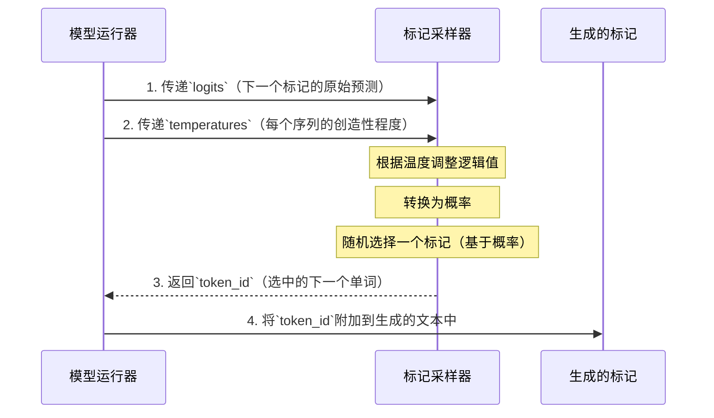

# 第8章：标记采样器

在[第7章：全局推理上下文](07_global_inference_context_.md)中，我们学习了[模型运行器](05_model_runner_.md)如何使用共享的"白板"为所有[神经网络层](06_neural_network_layers_.md)提供计算所需的信息

这些层完成了令人难以置信的工作，最终生成了关于下一个单词应该是什么的原始预测。

想象一下，我们的AI模型刚刚"读取"了提示："给我讲一个关于勇敢骑士的故事"，现在它需要决定*下一个单词*。它经过深思熟虑，提出了以下可能性列表：

*   "The"：90%的概率
*   "A"：5%的概率
*   "Once"：3%的概率
*   "Knight"：1%的概率
*   "Dog"：0.5%的概率
*   ...（数百万个其他单词，概率极小）

这个可能性列表通常被称为"逻辑值"（原始分数）或"概率"，是模型的预测结果。但我们如何将这些百分比转化为一个具体的单词，添加到我们的故事中？我们如何控制AI是总是选择最明显的单词，还是偶尔冒险选择更具创意的单词？

这就是**标记采样器**的用武之地

标记采样器是负责从模型的预==测中选择*一个*下一个单词（标记）的组件==。它就像一个决策者，将模型的统计可能性转化为具体的新标记，附加到生成的文本中。

## 它解决了什么问题？

如果没有标记采样器，AI模型将只能处理数字。你会得到一系列概率，而不是一个实际的故事！采样器解决了以下问题：

1.  **将概率转化为选择**：从一系列数值可能性中挑选一个具体的项目。
2.  **控制创造性（温度）**：允许你影响选择的方式。我们是总是选择概率最高的单词（使AI更可预测但安全），还是偶尔选择概率稍低但更有趣的单词（使AI更具创造性/随机性）？这通常由一个称为"温度"的参数控制。

采样器确保模型的数学输出成为你期望的可读、流畅的文本，并带有可配置的个性。

## 标记采样的核心概念

让我们看看标记采样器工作的主要思想：

| 概念       | 类比（厨师选择食材）                                         | 对LLM的意义                                                  |
| :--------- | :----------------------------------------------------------- | :----------------------------------------------------------- |
| **逻辑值** | 厨师对每种食材的原始偏好分数（例如，"番茄：10，洋葱：8，罗勒：5"）。 | [神经网络层](06_neural_network_layers_.md)输出的原始数值，表示每个下一个标记的"好坏"。 |
| **概率**   | 将偏好分数转换为百分比（例如，"番茄：50%，洋葱：30%，罗勒：20%"）。 | 通过"softmax"函数将`logits`转换为概率列表，所有概率之和为100%。 |
| **采样**   | 基于这些百分比选择*一种*食材的行为。                         | 根据概率从词汇表中选择单个`token_id`的过程。                 |
| **温度**   | 厨师的冒险程度。低温：总是选择最喜欢的。高温：愿意尝试新事物。 | 控制采样随机性的数字（`SamplingParams.temperature`）。<br> - **低温（例如0.1-0.5）**：偏向高概率标记，使输出更可预测和集中。<br> - **高温（例如0.8-1.5）**：增加低概率标记被选中的可能性，导致更多样化、创造性甚至"幻觉"的输出。 |

## 采样器的工作原理：高层视角

标记采样器是一个内部组件，与我们讨论过的许多其他组件类似。不会直接调用它。相反，[模型运行器](05_model_runner_.md)在神经网络处理输入并生成`logits`后使用它。

以下是事件的简化序列：



1.  **[模型运行器](05_model_runner_.md)准备**：[模型运行器](05_model_runner_.md)首先收集`logits`（模型的原始预测）和所有活动序列的`temperature`设置（来自它们的[生成序列](02_generation_sequence_.md)对象）。
2.  **[模型运行器](05_model_runner_.md)调用采样器**：然后将这些传递给`Sampler`。
3.  **采样器处理**：`Sampler`接收`logits`和`temperature`。它根据`temperature`调整`logits`，将其转换为概率，然后智能地为每个序列选择一个`token_id`。
4.  **采样器返回**：选中的`token_id`返回给[模型运行器](05_model_runner_.md)。
5.  **输出**：[模型运行器](05_model_runner_.md)然后用这些新生成的标记更新[生成序列](02_generation_sequence_.md)对象。

## 内部机制：`Sampler`类

标记采样的核心逻辑位于`nanovllm/layers/sampler.py`中的`Sampler`类中。

### 初始化采样器

`Sampler`由[模型运行器](05_model_runner_.md)在初始化时创建一次，准备在需要选择新标记时调用。

```python
# nanovllm/engine/model_runner.py (简化)
# ...
from nanovllm.layers.sampler import Sampler

class ModelRunner:
    def __init__(self, config: Config, rank: int, event: Event | list[Event]):
        # ... 其他设置 ...
        self.model = Qwen3ForCausalLM(hf_config)
        self.sampler = Sampler() # 采样器诞生！
        # ... 其余初始化 ...
```
这里，`self.sampler = Sampler()`创建了我们的`Sampler`实例，供`ModelRunner`使用。

### 准备`temperatures`

在调用`Sampler`之前，[模型运行器](05_model_runner_.md)需要为当前处理的每个序列收集`temperature`设置。这些`temperature`值来自每个[生成序列](02_generation_sequence_.md)关联的`SamplingParams`。

```python
# nanovllm/engine/model_runner.py (简化)
# ...
from nanovllm.engine.sequence import Sequence

class ModelRunner:
    # ...
    def prepare_sample(self, seqs: list[Sequence]):
        """收集每个序列的温度设置。"""
        temperatures = []
        for seq in seqs:
            temperatures.append(seq.temperature) # 从每个序列获取温度
        
        # 转换为GPU张量以提高处理效率
        temperatures = torch.tensor(temperatures, dtype=torch.float32, pin_memory=True).cuda(non_blocking=True)
        return temperatures
```
`prepare_sample`方法遍历活动`Sequence`对象列表，提取它们的`temperature`设置，并将其收集到一个GPU张量中。

### 运行`Sampler`

实际的采样发生在[模型运行器](05_model_runner_.md)的`run`方法中，它调用`self.sampler(...)`：

```python
# nanovllm/engine/model_runner.py (简化)
# ...
class ModelRunner:
    # ...
    def run(self, seqs: list[Sequence], is_prefill: bool) -> list[int]:
        input_ids, positions = self.prepare_prefill(seqs) if is_prefill else self.prepare_decode(seqs)
        
        # 只有主GPU处理采样
        temperatures = self.prepare_sample(seqs) if self.rank == 0 else None
        
        logits = self.run_model(input_ids, positions, is_prefill)
        
        # <<< 这里！调用采样器选择标记 >>>
        token_ids = self.sampler(logits, temperatures).tolist() if self.rank == 0 else None
        
        reset_context()
        return token_ids
```
这里，`self.sampler(logits, temperatures)`是关键行，`Sampler`在此接管。`logits`直接来自`run_model`的输出，`temperatures`由`prepare_sample`准备。

### `Sampler`类内部

现在，让我们看看`Sampler`类本身，重点关注其`forward`方法，魔法在此发生。

```python
# nanovllm/layers/sampler.py
import torch
from torch import nn

class Sampler(nn.Module):

    def __init__(self):
        super().__init__()

    @torch.compile # 此装饰器有助于优化函数
    def forward(self, logits: torch.Tensor, temperatures: torch.Tensor):
        # 1. 根据温度调整逻辑值
        logits = logits.float().div_(temperatures.unsqueeze(dim=1))
        
        # 2. 转换为概率（softmax）
        probs = torch.softmax(logits, dim=-1)
        
        # 3. 以可控的随机性采样标记（Gumbel采样）
        sample_tokens = probs.div_(torch.empty_like(probs).exponential_(1).clamp_min_(1e-10)).argmax(dim=-1)
        return sample_tokens
```
让我们分解这个`forward`方法：

1.  **`logits = logits.float().div_(temperatures.unsqueeze(dim=1))`**：这是`temperature`影响`logits`的地方。
    *   如果`temperature`高（例如1.0），`logits`被较大的数除，使其"更平坦"（概率之间的差异变小）。这意味着不太可能的标记有更好的机会。
    *   如果`temperature`低（例如0.1），`logits`被较小的数除，使其"更尖锐"（差异变大）。这意味着最可能的标记更受青睐。
    *   `unsqueeze(dim=1)`确保`temperatures`可以正确地在每个序列的所有标记之间分配。
2.  **`probs = torch.softmax(logits, dim=-1)`**：调整后的`logits`通过`softmax`函数。`softmax`将原始分数转换为概率分布，确保所有值为正且和为1。现在，`probs`告诉我们每个标记被选中的百分比概率。
3.  **`sample_tokens = probs.div_(torch.empty_like(probs).exponential_(1).clamp_min_(1e-10)).argmax(dim=-1)`**：这是一种巧妙且高效的方式，用于执行带有随机性的采样，通常称为Gumbel采样或Gumbel-max技巧。
    *   `torch.empty_like(probs).exponential_(1)`从指数分布生成随机数。这为概率添加了"噪声"。
    *   通过将`probs`除以这个噪声，采样器引入了可控的随机性。
    *   `argmax(dim=-1)`然后简单地选择在应用噪声后具有最高值的标记。由于噪声是随机的，最高概率的标记不会*总是*被选中，尤其是在高温下，从而产生创造性的变化。

`@torch.compile`装饰器在此被`nano-vllm`用于告诉PyTorch高度优化整个采样过程，以提高GPU上的速度。

## 结论

**标记采样器**是文本生成流水线中最后的关键步骤。它接收来自AI模型的高度复杂的数值预测（`logits`），并在你的`temperature`设置指导下，将其转化为构成生成文本的实际单词（`token_id`）

- 巧妙地将概率转换与可控随机性相结合，`Sampler`使`nano-vllm`能够生成不仅连贯而且可以根据你的偏好表现出不同程度创造性的输出。

至此，已经完成了对`nano-vllm`核心组件的探索！现在，对这个强大引擎如何从管理请求到运行神经网络，最终选择你所看到的单词有了基本的理解~

END *★,°*:.☆(￣▽￣)/.°★* 。

