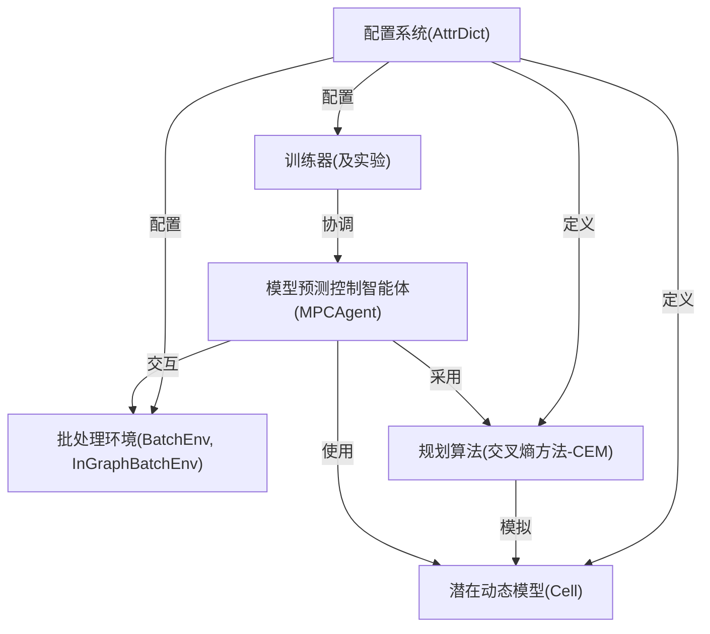
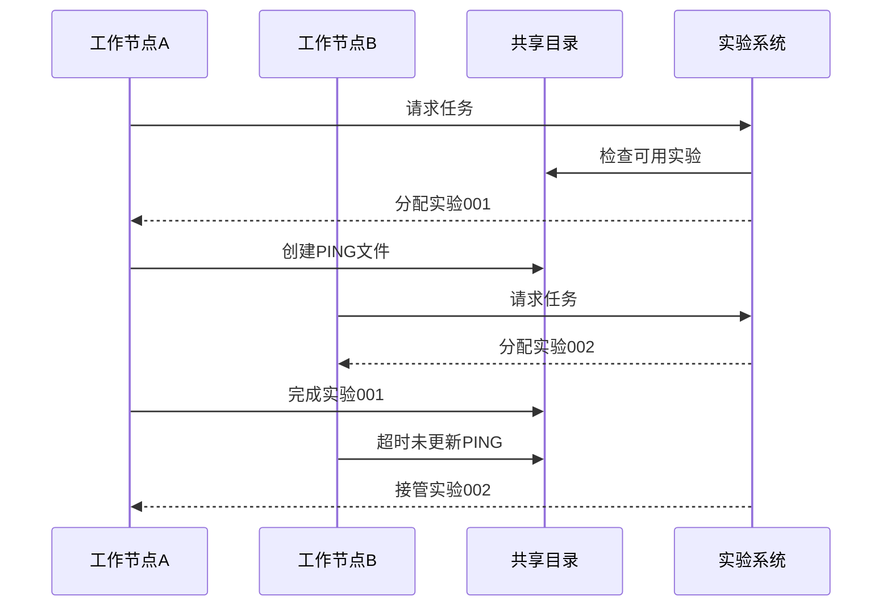
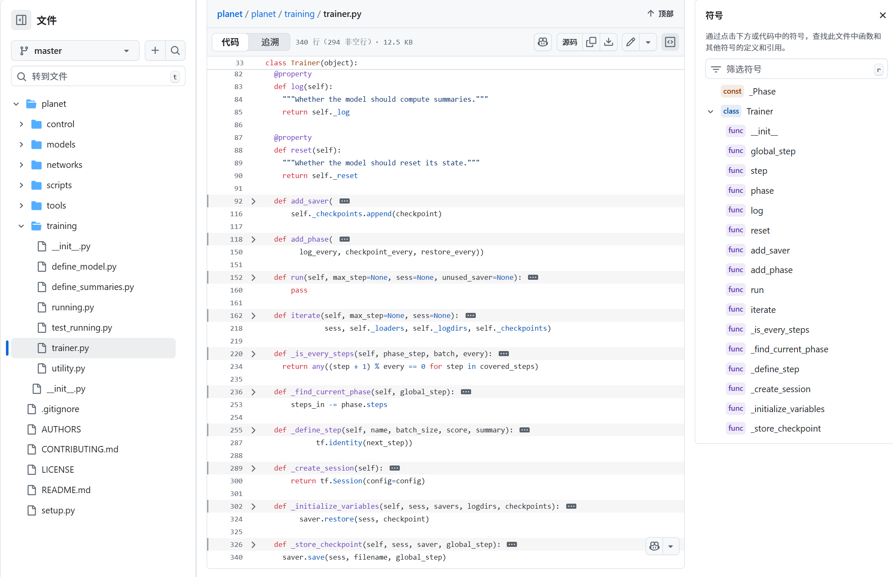

链接：[Introducing PlaNet: A Deep Planning Network for Reinforcement Learning](https://research.google/blog/introducing-planet-a-deep-planning-network-for-reinforcement-learning/)

20年的paper，看哭了，刚初中毕业时的..

# docs：planet项目

`planet`项目实现了**PlaNet智能体**，这是一种先进的强化学习系统，能够学习对未来进行"想象"

该系统通过像素等原始观测数据构建内部**世界模型**，从而**预测**其行为将如何改变环境。通过在想象中==模拟==多种可能的未来状态，该智能体能够在复杂环境中**规划**有效行动并做出**智能决策**，而无需大量现实世界交互。

## 可视化



## 章节内容

1. [训练器(及实验)](01_trainer__and_experiment__.md)
2. [模型预测控制智能体(MPCAgent)](02_mpcagent__model_predictive_control_agent__.md)
3. [批处理环境(BatchEnv, InGraphBatchEnv)](03_batch_environments__batchenv__ingraphbatchenv__.md)
4. [潜在动态模型(Cell)](04_latent_dynamics_model__cell__.md)
5. [规划算法(交叉熵方法-CEM)](05_planning_algorithm__cross_entropy_method___cem__.md)
6. [配置系统(AttrDict)](06_configuration_system__attrdict__.md)

---
# 第1章：训练器与实验系统

训练强大的人工智能模型（尤其是强化学习领域）是一个复杂且耗时的过程。这不仅仅是编写代码并运行一次那么简单，而是涉及：
* 让学习算法`反复`运行数百万步
* 在`教授`新知识（训练）和测试性能（评估）之间交替进行
* 定期`保存`AI进度（称为"检查点"）以防计算中断
* 详细记录AI的表现和学习过程（日志汇总）
* 可能同时运行多个AI版本以寻找最佳方案（多轮"实验"）
* 确保所有操作可靠执行，即使面对多台可能故障的计算机

以训练AI控制虚拟猎豹奔跑为例：
1. 初始化猎豹环境
2. AI尝试采取行动
3. 观察结果并学习
4. 重复数百万次
5. 定期暂停学习，测试当前奔跑速度
6. 保存AI"大脑"以便后续训练
7. 并行尝试不同训练方法（如同时运行10-100个版本）

这正是PlaNet中`Trainer`和`Experiment`的用武之地

它们如同专业项目经理，帮我们可靠地处理所有这些复杂任务。

---

## 训练器与实验系统

### 1. 训练器（项目执行者）
`Trainer`是单个训练过程的核心协调者，相当于专职的项目经理，负责：
* 管理训练循环（学习与更新的持续交替）
* 在不同学习阶段（如训练/评估）间切换
* 精确记录AI的每一步（"全局步数"）
* 将关键指标写入日志（供TensorBoard等工具使用）
* 定期保存AI知识快照（模型检查点）

### 2. 实验系统（研究总监）
`Experiment`是更高层的管理者，协调多个`Trainer`项目：
* 分配不同工作节点处理不同训练任务
* 在节点故障时自动恢复任务
* 确保所有实验最终完成

简言之，==`Experiment`负责多任务并行执行的框架，而`Trainer`专注单个任务的细节执行==。

---

## 协同工作机制

`train.py`脚本展示了标准工作流程：

```python
# planet/scripts/train.py 核心逻辑
def main(args):
  # 1. 初始化日志系统
  training.utility.set_up_logging()

  # 2. 创建实验管理器
  experiment = training.Experiment(
      args.logdir,   # 所有实验的存储目录
      process_fn=partial(process, args=args), # 单个实验的处理函数
      num_runs=args.num_runs) # 总实验次数

  # 3. 执行每个实验
  for run in experiment:
    pass  # 实际训练在process函数中完成

def process(logdir, args):
  # 创建并运行训练器
  for score in training.utility.train(define_model, dataset, logdir, config):
    yield score  # 返回评估分数
```

**执行流程：**
1. 创建`Experiment`实例，指定存储路径和实验次数
2. 实验系统分配具体任务给`Trainer`
3. `Trainer`执行训练/评估循环，保存结果

---

## 实验系统：分布式协调引擎

当需要多机并行时，`Experiment`通过文件系统实现分布式协调：

### 协调机制
* **PING文件**：工作节点声明任务所有权（类似"实验中"标牌）
* **DONE文件**：标记已完成实验
* **FAIL文件**：标记失败实验



**容错机制**：当节点B崩溃时，其PING文件超时后，==节点A会自动接管==未完成实验。

---

## 训练器：执行引擎详解

`Trainer`通过阶段化管理实现灵活的训练控制：

### 核心功能
| 功能         | 说明                    | 示例                     |
| ------------ | ----------------------- | ------------------------ |
| 阶段管理     | 划分训练/评估等不同阶段 | 每100万训练步后评估1万步 |
| 全局步数记录 | 跨阶段的总步骤统计      | 从0开始持续累加          |
| 日志记录     | 保存指标供可视化分析    | 每1000步记录loss曲线     |
| 模型检查点   | 定期保存完整模型状态    | 每10万步保存一次         |

### 代码实现



```python
# planet/training/trainer.py 
class Trainer:
  def add_phase(self, name, steps, score_op, summary_op):
    """添加训练阶段"""
    self._phases.append(_Phase(
        name, steps, score_op, summary_op))

  def iterate(self, max_step=None):
    while True:
      current_step = sess.run(self._global_step)
      phase = self._get_current_phase(current_step)
      
      # 执行阶段操作
      summary, score = sess.run([phase.op, phase.score])
      
      if self._should_save_checkpoint(current_step):
        self._save_checkpoint()
      
      if self._should_report(current_step):
        yield score  # 返回评估结果
```

**阶段化训练**：通过==`add_phase`定义不同阶段（如预训练/微调），`iterate`自动按全局步数切换阶段==。

---

## 总结

本章解析了PlaNet的训练管理系统：
1. **实验系统**实现多实验的分布式调度与容错
2. **训练器**提供精细化的阶段控制与状态管理

二者共同构成了强化学习研究的可靠基础设施。

接下来我们将探讨利用训练结果的决策智能体：[模型预测控制智能体](02_mpcagent__model_predictive_control_agent__.md)。