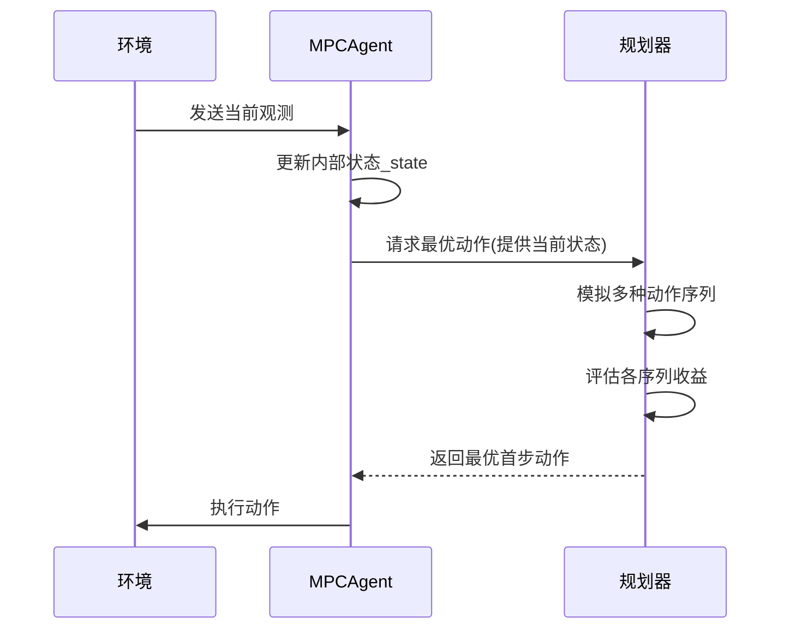

# 第2章：模型预测控制智能体(MPCAgent)

在上一章中，我们了解了[训练器与实验系统](01_trainer__and_experiment__.md)，它如同勤勉的经理，监督着AI的整个学习过程。但当==AI完成学习后，它如何在实际环境中做出决策==？

这就是`MPCAgent`的职责所在——它是运用所学知识在环境中采取行动的"决策大脑"。

---

## 核心问题：AI如何做决策？

假设我们训练机器人玩推球进洞游戏：
- 简单AI可能直接学习"球在这里→向左推"的映射
- 但当球位稍有变化，或需要多步操作时，这种简单反应就会失效

我们需要具备**规划能力**的AI，这正是`MPCAgent`（模型预测控制智能体）的设计目标。

---

## MPCAgent：智能规划者

`MPCAgent`的工作方式如同专注的棋手：
1. **世界模型**：依赖[潜在动态模型(Cell)](04_latent_dynamics_model__cell__.md)作为内部模拟器
2. **未来模拟**：在脑海中尝试多种动作序列
3. **评估预测**：计算每个模拟序列的预期收益
4. **执行首步**：仅执行最优序列的第一个动作
5. **循环规划**：每步都重新观察环境并重新规划



---

## 代码实现

### 核心组件(`planet/control/mpc_agent.py`)

**初始化**：
```python
class MPCAgent:
    def __init__(self, batch_env, config):
        self._cell = config.cell  # 潜在动态模型
        self._state = ...  # 内部世界状态
        self._prev_action = ...  # 上一步动作
```

**决策流程**：
```python
def perform(self, observ):
    # 1. 编码观测数据
    embedded = self._config.encoder(observ)  
    
    # 2. 更新内部状态
    _, state = self._cell((embedded, self._prev_action), self._state)
    
    # 3. 调用规划器寻找最优动作
    action_sequence = self._config.planner(
        self._cell, self._config.objective, state)
    
    # 4. 取最优序列的首个动作
    action = action_sequence[0]  
    
    # 5. 保存状态和动作
    self._prev_action = action
    self._state = state
    return action
```

---

## 模拟循环集成

在`simulate.py`中，`MPCAgent`被整合进环境交互循环：

```python
def simulate_step(batch_env, agent):
    # 获取智能体决策
    action = agent.perform(observation)  
    # 执行动作并获取新状态
    new_obs = batch_env.step(action)
    return new_obs
```

---

## 总结

`MPCAgent`通过：
1. **==内部模拟==**：利用世界模型预测多步行动后果
2. **优化选择**：基于目标函数==评估最优==方案
3. **闭环控制**：每步重新规划适应变化

这种模型预测控制方法使AI在复杂任务中展现出==类人的前瞻性决策能力==。接下来我们将探索其决策基础：[批处理环境系统](03_batch_environments__batchenv__ingraphbatchenv__.md)。