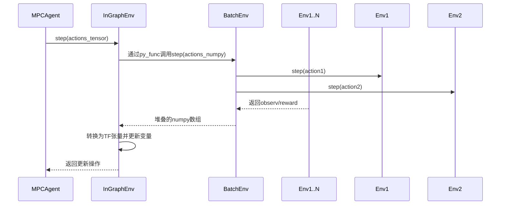

# 第3章：批处理环境系统(BatchEnv与InGraphBatchEnv)

在[上一章](02_mpcagent__model_predictive_control_agent__.md)中，我们探讨了使用==内部世界模型进行决策的`MPCAgent`==。但若想加速训练过程，仅与单一环境交互（如同单个学生在模拟器中学习）效率太低。**批处理环境系统**正是为此而生，它使`MPCAgent`能==并行管理多个环境交互==。

---

## 核心问题：数据收集效率瓶颈

以训练机器人走迷宫为例：
- 每个动作需等待环境响应
- 单次仅收集一条经验数据
- ==现代深度强化学习需要海量多样化数据==

批处理环境系统通过`并行管理多个独立环境，实现数据收集的规模化加速`。

---

## 核心组件

### 1. BatchEnv：环境批处理器
将多个独立环境实例聚合为统一接口：

```python
class BatchEnv:
    def __init__(self, envs, blocking=True):
        self._envs = envs  # 环境实例列表
        self._blocking = blocking  # 同步/异步模式

    def step(self, actions):
        # 并行执行动作：action[0]→envs[0], action[1]→envs[1]...
        results = [env.step(action) for env, action in zip(self._envs, actions)]
        # 将结果堆叠为统一数组
        observs = np.stack([r[0] for r in results])
        rewards = np.stack([r[1] for r in results])
        return observs, rewards, ...
```

**工作模式**：
- **阻塞模式**：顺序执行各环境步骤
- **非阻塞模式**：利用多线程/进程实现真正并行

### 2. InGraphBatchEnv：TensorFlow集成器
将BatchEnv操作嵌入TensorFlow计算图：

```python
class InGraphBatchEnv:
    def __init__(self, batch_env):
        # 创建TF变量存储环境状态
        self._observ = tf.Variable(..., name='observ')
        self._reward = tf.Variable(..., name='reward')
        
    def step(self, actions):
        # 通过tf.py_func调用Python端BatchEnv
        new_obs, new_reward = tf.py_func(
            self._batch_env.step, [actions], 
            [tf.float32, tf.float32])
        # 更新TF变量
        return tf.group(
            self._observ.assign(new_obs),
            self._reward.assign(new_reward))
```

关键
- `tf.py_func`实现Python-TensorFlow无缝桥接
- 状态变量自动微分支持

---

## 系统协同工作流



---

## 性能对比

| 特性         | BatchEnv             | InGraphBatchEnv   |
| ------------ | -------------------- | ----------------- |
| **执行环境** | Python运行时         | TensorFlow计算图  |
| **数据格式** | NumPy数组            | TensorFlow张量    |
| **并行策略** | 线程/进程级并行      | 图优化+设备级并行 |
| **典型延迟** | 毫秒级Python调用开销 | 微秒级图操作开销  |

---

## 工程实现要点

### 环境初始化流程
```python
def create_parallel_envs():
    # 1. 创建基础环境列表
    base_envs = [make_env() for _ in range(N)]
    
    # 2. 封装为BatchEnv
    batch_env = BatchEnv(base_envs, blocking=False)
    
    # 3. 集成到TensorFlow图
    in_graph_env = InGraphBatchEnv(batch_env)
    return in_graph_env
```

### 动态批次处理
通过`indices`参数支持灵活的环境子集操作：
```python
def reset_subset(env, indices):
    # 仅重置指定索引的环境
    partial_obs = env.reset(indices=indices)
    # 自动处理部分观测更新
```

---

## 总结

批处理环境系统通过：
1. **环境并行化**：BatchEnv实现多环境同步控制
2. **计算图集成**：InGraphBatchEnv消除Python-TF交互瓶颈
3. **状态统一管理**：TF变量实现自动微分支持

这种设计使得[MPCAgent](02_mpcagent__model_predictive_control_agent__.md)能够高效地从并行交互中学习。接下来我们将深入其决策基础：[潜在动态模型(Cell)](04_latent_dynamics_model__cell__.md)。