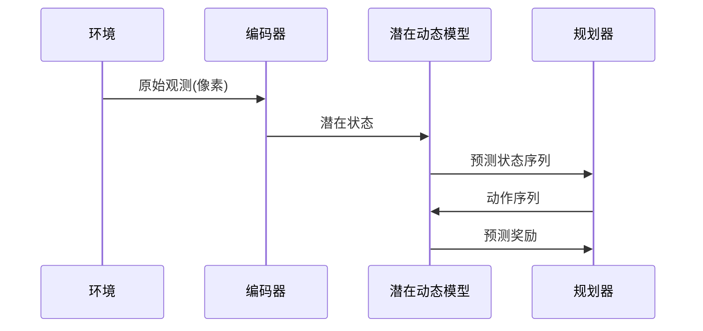

# 第4章：潜在动态模型(Cell)

在[上一章](03_batch_environments__batchenv__ingraphbatchenv__.md)中，我们了解了**批处理环境系统**如何让`MPCAgent`同时与多个模拟环境交互以加速数据收集

但`MPCAgent`是如何"模拟"未来的？

答案就在于**潜在动态模型(Cell)**——这是PlaNet智能体内部的"世界模拟器"。

---

## 核心问题：如何在心智中模拟复杂世界？

以教机器人叠彩色积木为例：
- 机器人看到散落的积木（原始像素图像）
- 它需要判断："如果我将红色积木推到此处，结果会怎样？这有助于叠放吗？"

若直接预测每个动作后的精确像素变化，任务将难以完成。我们需要更抽象的表示方式。

---

## 潜在动态模型：智能体的内部模拟器

`潜在动态模型(Cell)`通过以下组件实现高效心智模拟：

### 1. 潜在状态（心智快照）
- 压缩表示世界的关键信息（如积木坐标/颜色）
- 相比原始像素，维度大幅降低

### 2. 动态模型（世界规则）
- 学习动作如何改变潜在状态
- 类似内部物理引擎

### 3. 观测模型/编码器
- 将原始图像编码为潜在状态
- 提取关键信息，过滤噪声

### 4. 奖励模型
- 评估潜在状态的收益
- 指导智能体追求高回报状态



---

## 技术实现

### 核心架构
作为`tf.nn.rnn_cell.RNNCell`的子类，模型通过`call`方法处理时序数据：

```python
class Base(tf.nn.rnn_cell.RNNCell):
    def call(self, inputs, prev_state):
        obs, prev_action, use_obs = inputs
        # 先验预测（仅基于历史状态和动作）
        prior = self._transition(prev_state, prev_action)
        
        # 后验校正（结合新观测）
        posterior = tf.cond(use_obs[0,0],
            lambda: self._posterior(prev_state, prev_action, obs),
            lambda: prior)
        return (prior, posterior), posterior
```

### 工作流程
1. **观测编码**：`encoder`将图像转为紧凑表示
2. **状态更新**：结合新观测和动作更新潜在状态
3. **开环预测**：规划时仅用`transition`模型模拟未来
4. **闭环校正**：执行时用`posterior`模型修正预测

---

## 模型变体对比

| 模型类型 | 核心特点                    | 适用场景               |
| -------- | --------------------------- | ---------------------- |
| RSSM     | 结合确定性GRU与随机潜在状态 | 需要==长期记忆==的任务 |
| DRNN     | 双重循环网络结构            | ==复杂时序==依赖       |
| SSM      | 简单前馈结构                | ==低复杂度==环境       |

---

## 工程实践要点

### 状态初始化
```python
# MPCAgent初始化时创建潜在状态
initial_state = self._cell.zero_state(batch_size, tf.float32)
self._state = tf.Variable(initial_state)
```

### 规划与执行的差异处理
```python
# 规划阶段（无真实观测）
simulated_state = cell((None, action, False), prev_state)

# 执行阶段（有真实观测）
updated_state = cell((observation, action, True), prev_state)
```

---

## 总结

潜在动态模型通过：
1. **状态压缩**：将==高维观测映射到低维==潜在空间
2. **双模预测**：==先验模拟与后验校正==相结合
3. **高效规划**：在==抽象空间进行快速推演==

这种设计使得[MPCAgent](02_mpcagent__model_predictive_control_agent__.md)能够实现类人的前瞻性决策。接下来我们将深入其规划机制：[交叉熵方法(CEM)](05_planning_algorithm__cross_entropy_method___cem__.md)。