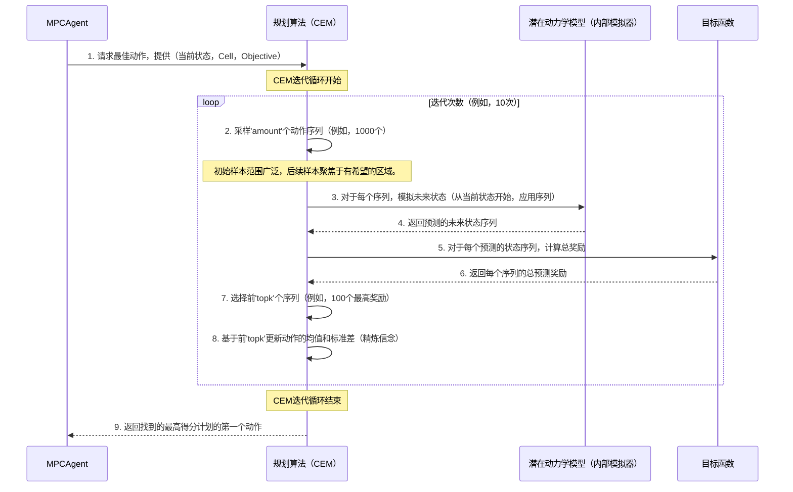
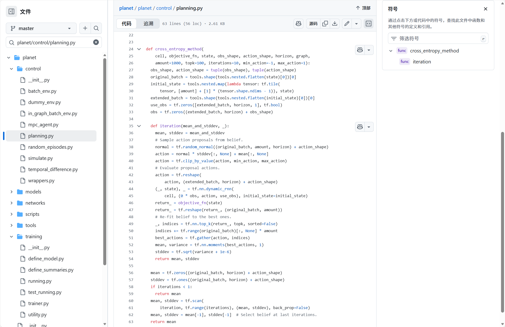

# 第5章：规划算法（交叉熵方法 - CEM）

在[上一章](04_latent_dynamics_model__cell__.md)中，我们揭示了`潜在动力学模型（Cell）`背后的魔力——这个"想象引擎"使我们的PlaNet智能体能够在其内部心智世界中模拟未来事件。[MPCAgent（模型预测控制智能体）](02_mpcagent__model_predictive_control_agent__.md)使用这个模型来预测如果采取某些动作可能会发生什么。

但这里有一个新的挑战：如果智能体可以想象*无数*可能的未来动作序列，它如何决定哪个序列是*最佳*的追求目标？它不能模拟*每一个*可能性；那将永远完不成

我们需要一种==智能且高效的方法来搜索所有这些想象的未来，并选择最有希望的路径==。

这就是**规划算法（交叉熵方法 - CEM）**的用武之地！CEM是[MPCAgent（模型预测控制智能体）](02_mpcagent__model_predictive_control_agent__.md)采用的特定策略，用于快速找到有效的动作序列，即使面对压倒性数量的选择。

---

### 问题：在不尝试所有可能的情况下找到最佳路径

想象一下，我们站在一个复杂的虚拟世界中，我们的目标是穿越危险的地形到达宝箱。我们可以在脑海中想象许多不同的路径：
*   路径A：向左走，跳跃，然后攀爬...（预测10金币，低风险）
*   路径B：直走，偷偷绕过怪物，然后奔跑...（预测100金币，高风险）
*   路径C：向右走，找到隐藏的捷径...（预测50金币，中等风险）

如果我们只需要决定*第一步*，我们如何选择？如果我们必须在脑海中模拟接下来10秒内*每一个可能的*步骤序列，我们将在那里待上一整天！这就像试图通过玩完每一场游戏来找到国际象棋中的最佳走法。这在计算上是不可能的。

我们需要一种==巧妙的方法来缩小搜索范围，并快速锁定好的选项==。

---

### 交叉熵方法（CEM）：智能头脑风暴和精炼

交叉熵方法（CEM）是一种迭代搜索算法，其工作方式很像高效的头脑风暴会议：

1.  **从许多随机想法开始（初始头脑风暴）：** CEM首先随机生成大量可能的动作序列（我们称之为"计划"）。这些就像疯狂的猜测，但它们涵盖了广泛的可能性。
    *   *示例：* 对于我们的寻宝游戏，生成1000个随机计划，每个计划描述10个未来步骤（例如，"左，跳，左，走，..."）。

2.  **评估每个想法（心理演练）：** 对于每个生成的计划，[MPCAgent（模型预测控制智能体）](02_mpcagent__model_predictive_control_agent__.md)使用其内部[潜在动力学模型（Cell）](04_latent_dynamics_model__cell__.md)来*心理模拟*如果执行该计划会发生什么。然后它==使用`奖励`或`objective_fn`来计算该模拟未来有多"好"==（例如，有多少宝藏，有多安全）。
    *   *示例：* 模拟所有1000个计划。计划1产生5金币。计划2产生80金币。计划3产生20金币。

3.  **选择最有希望的想法（顶级表现者）：** 在评估所有计划后，CEM选择一小部分表现最好的计划（例如，产生最高预测奖励的前10%的计划）。
    *   *示例：* 识别产生最多金币的100个计划。

4.  **精炼我们的信念（聚焦我们的头脑风暴）：** CEM不是从头开始生成新的随机想法，而是==分析选定的"顶级表现者"==。它计算它们的平均动作以及它们的变化程度。这些信息形成了关于好动作所在位置的"信念"。然后生成新的计划，但这次，它们*偏向*这些顶级表现者。这就像在说，"这100个想法很好，所以让我们生成更多类似这些的想法。"
    *   *示例：* 如果前100个计划大多涉及首先"向左走"，然后"跳跃"，那么新的随机计划将更有可能以"左"和"跳"开始。

5.  **重复和收敛（迭代改进）：** 步骤2-4重复几次（通常是5-10次迭代）。每次迭代，关于好动作的"信念"变得更加集中，生成的计划逐渐变得更好。
    *   *示例：* 经过10次迭代后，生成的计划被高度优化以安全地找到最多的宝藏。

6.  **执行最佳第一步：** 最后，在所有迭代之后，==CEM返回找到的最佳计划的*第一个动作*==。然后[MPCAgent（模型预测控制智能体）](02_mpcagent__model_predictive_control_agent__.md)在真实环境中执行这个单一动作，观察结果，并为下一步重新开始整个规划过程。

CEM通过迭代地将搜索集中在有希望的区域，有效且高效地探索可能动作序列的广阔空间，==快速收敛到一个优秀的第一个动作==。

---

### CEM如何解决机器人-球用例

让我们重温一下我们的机器人试图将球推入球门的场景，这来自[MPCAgent章节](02_mpcagent__model_predictive_control_agent__.md)。

1.  **机器人观察球：** `MPCAgent`使用[潜在动力学模型（Cell）](04_latent_dynamics_model__cell__.md)更新其内部`_state`（球位置的心理图像）。
2.  **CEM开始头脑风暴：**
    *   CEM生成，比如说，`1000`个包含`12`个动作的随机序列（我们的`horizon`，或我们计划未来多少步）。每个序列都是一个"计划"。
3.  **CEM评估计划：**
    *   对于这`1000`个计划中的每一个，CEM使用`MPCAgent`的[潜在动力学模型（Cell）](04_latent_dynamics_model__cell__.md)来模拟未来`12`步。它预测球如何移动以及机器人在每一步获得什么`奖励`。
    *   `objective_fn`将这些预测的奖励相加，以获得每个计划的总分。
4.  **CEM选择顶级计划：**
    *   CEM识别出导致最高预测总分的`100`个计划（`topk`）。
5.  **CEM为下一次头脑风暴精炼：**
    *   它计算这`100`个最佳计划中每个`12`个时间步的平均动作。它还计算这些动作的变化程度（它们的标准差）。
    *   对于*下一次*迭代，生成`1000`个新的随机计划，但现在它们是从以最佳计划的平均值为中心的分布中抽取的，"分散"程度类似于它们的变化。
6.  **CEM重复：** 这个过程（步骤3-5）重复`10`次（`iterations`）。==每次迭代，生成的计划质量都会显著提高==。
7.  **机器人采取行动：** 经过`10`次迭代后，CEM有一个高度优化的计划分布。它选择找到的总体最佳计划，机器人*仅执行该计划的第一个动作*。
8.  **循环继续：** 机器人观察球的新状态，整个CEM过程再次开始下一个时间步。这确保机器人不断重新规划和适应。

---

### MPCAgent与规划算法（CEM）的交互

[MPCAgent（模型预测控制智能体）](02_mpcagent__model_predictive_control_agent__.md)是协调者。当它需要决定下一个动作时，它只需调用其配置的`planner`（这是我们的CEM实现）。

```python
# 来自 planet/control/mpc_agent.py（简化的`perform`方法）

  def perform(self, agent_indices, observ):
    # ...（观察预处理并编码为'embedded'）...
    # ...（使用潜在动力学模型更新内部'state'）...

    # 调用规划算法（CEM）来找到最佳动作序列
    # 它提供潜在动力学模型（_cell），目标函数，
    # 当前心理状态和形状信息。
    action_sequence = self._config.planner(
        self._cell,                   # 潜在动力学模型（我们的内部模拟器）
        self._config.objective,       # 如何为计划评分（例如，预测奖励的总和）
        state,                        # 智能体的当前心理状态
        embedded.shape[1:].as_list(), # 图像特征的形状
        prev_action.shape[1:].as_list() # 动作的形状
    )
    
    # 我们只关心找到的最佳序列的第一个动作
    action = action_sequence[:, 0] 

    # ...（探索，裁剪，记住状态和动作）...
    return tf.identity(action), tf.constant('')
```
**解释：**
*   `self._config.planner(...)`是关键行。这调用了`cross_entropy_method`函数，该函数在配置中绑定到`_config.planner`。
*   它传递`_cell`（[潜在动力学模型（Cell）](04_latent_dynamics_model__cell__.md)），以便CEM可以执行其模拟。
*   它传递`_config.objective`，以便CEM知道如何评估不同计划的预测结果。
*   它传递当前`state`作为所有模拟的起点。
*   `action = action_sequence[:, 0]`然后仅提取CEM找到的最佳序列的第一个动作。

---

### 底层机制：CEM工作流程

让我们可视化CEM在`MPCAgent`决策过程中的迭代性质。



**解释：**
1.  `MPCAgent`要求`Planner`（CEM）找到下一个最佳动作，给它起点（`state`），模拟引擎（`Cell`）和评估标准（`Objective`）。
2.  CEM进入其迭代循环。在每次迭代中：
    *   它生成一批`amount`（例如，1000个）动作序列。
    *   然后它将这些动作序列交给`潜在动力学模型（Cell）`进行心理模拟会发生什么。`Cell`预测未来的`state`。
    *   `目标函数`评估这些预测的`state`序列以获得分数（例如，总预测奖励）。
    *   CEM按分数对所有`amount`个计划进行排名，并选择`topk`个最佳计划。
    *   然后它使用这些`topk`个计划来更新其关于每个`horizon`步骤中好动作的统计"信念"（均值和标准差）。
3.  经过`iterations`（例如，10次）的精炼后，CEM将它找到的总体最佳序列的*第一个动作*返回给`MPCAgent`。

---

### 探讨：CEM代码（`planet/control/planning.py`）



交叉熵方法的核心在`planet/control/planning.py`中的`cross_entropy_method`函数中实现。

```python
# 来自 planet/control/planning.py
import tensorflow as tf
from planet import tools

def cross_entropy_method(
    cell, objective_fn, state, obs_shape, action_shape, horizon, graph,
    amount=1000, topk=100, iterations=10, min_action=-1, max_action=1):
  
  # 准备初始状态：将其平铺'amount'次以进行并行模拟
  initial_state = tools.nested.map(
      lambda tensor: tf.tile(tensor, [amount] + [1] * (tensor.shape.ndims - 1)),
      state)
  
  # 为观察设置占位符张量和指示没有真实观察的标志（用于想象）
  use_obs = tf.zeros([extended_batch, horizon, 1], tf.bool)
  obs = tf.zeros((extended_batch, horizon) + obs_shape)

  def iteration(mean_and_stddev, _): # 此函数表示一次CEM迭代
    mean, stddev = mean_and_stddev
    
    # 1. 从我们当前的'信念'（均值和标准差）中采样动作提议
    normal = tf.random_normal((original_batch, amount, horizon) + action_shape)
    action = normal * stddev[:, None] + mean[:, None] # 使样本偏向均值
    action = tf.clip_by_value(action, min_action, max_action) # 保持动作在有效范围内
    
    # 为动力学模型重塑动作
    action = tf.reshape(action, (extended_batch, horizon) + action_shape)
    
    # 2. 通过使用潜在动力学模型（Cell）进行模拟来评估提议的动作
    # tf.nn.dynamic_rnn为'horizon'步展开'cell'
    (_, state_sequence), _ = tf.nn.dynamic_rnn(
        cell, (0 * obs, action, use_obs), # 输入：（无真实观察，动作，无use_obs标志）
        initial_state=initial_state)     # 从当前心理状态开始
    
    # 3. 计算模拟序列的预测奖励
    return_ = objective_fn(state_sequence)
    return_ = tf.reshape(return_, (original_batch, amount))
    
    # 4. 将我们的'信念'重新拟合到表现最好的计划
    _, indices = tf.nn.top_k(return_, topk, sorted=False) # 获取topk计划的索引
    indices += tf.range(original_batch)[:, None] * amount # 为批次调整索引
    best_actions = tf.gather(action, indices) # 从topk计划中获取实际动作
    
    # 从这些最佳动作计算新的均值和标准差
    mean, variance = tf.nn.moments(best_actions, 1)
    stddev = tf.sqrt(variance + 1e-6)
    return mean, stddev # 为下一次迭代返回

  # 为第一次迭代初始化均值和标准差（广泛的随机搜索）
  mean = tf.zeros((original_batch, horizon) + action_shape)
  stddev = tf.ones((original_batch, horizon) + action_shape) # 从宽方差开始

  # 使用tf.scan运行'iteration'函数'iterations'次
  if iterations < 1:
    return mean
  mean, stddev = tf.scan(
      iteration, tf.range(iterations), (mean, stddev), back_prop=False)
  
  # 从最后一次迭代中选择均值，它代表最佳计划
  mean, stddev = mean[-1], stddev[-1]
  return mean # 返回找到的最佳动作序列的均值
```

**解释：**
1.  **初始化**：`initial_state`被复制`amount`次。这样我们可以从*相同的起点*运行`amount`（例如，1000个）并行心理模拟。`use_obs`和`obs`设置为零，因为在规划期间，我们正在*想象*未来，没有真实的观察来馈送到`Cell`。
2.  **`iteration`函数**：此函数定义了CEM算法的单个步骤。
    *   **采样动作**：`tf.random_normal`生成随机数。这些数字按`stddev`缩放并按`mean`移位以采样新的`action`序列。在第一次迭代中，`mean`为零，`stddev`为一，导致完全随机的动作。在后续迭代中，它们反映了迄今为止找到的最佳动作。
    *   **使用`tf.nn.dynamic_rnn`进行模拟**：这是一个强大的TensorFlow函数，有效地"展开"`cell`（我们的[潜在动力学模型（Cell）](04_latent_dynamics_model__cell__.md)）`horizon`步。它接受`initial_state`，对于每一步，将采样序列中的相应`action`应用于`cell`。由于这里`use_obs`为`False`，`Cell`纯粹在其"想象模式"下运行（使用其`transition`模型）。这个块给我们`state_sequence` - 预测的未来潜在状态。
    *   **评估奖励**：调用`objective_fn(state_sequence)`来计算每个模拟序列的总预测奖励。此函数通常将`Cell`在每个时间步预测的奖励相加。
    *   **选择Top-K**：`tf.nn.top_k`找到具有最高预测奖励的`topk`（例如，100个）计划。
    *   **重新拟合信念**：`tf.nn.moments`计算此迭代中找到的`best_actions`的新`mean`和`variance`（从中导出`stddev`）。这个新的`mean`和`stddev`将指导*下一次*迭代中的采样，聚焦搜索。
3.  **`tf.scan`**：`tf.scan`函数用于应用`iteration`函数`iterations`次。它将一次迭代的`mean`和`stddev`作为输入馈送到下一次。
4.  **返回均值**：最后，返回*最后*一次迭代的动作分布的`mean`。这个`mean`代表CEM找到的最可能和表现最好的动作序列。然后[MPCAgent（模型预测控制智能体）](02_mpcagent__model_predictive_control_agent__.md)从这个`mean`序列中采取第一个动作。

这是一种巧妙且计算高效的方法，可以在不详尽搜索整个空间的情况下找到好的计划。

---

### CEM的配置（`planet/scripts/configs.py`）

==CEM的参数，如`amount`、`topk`、`iterations`和`horizon`，在PlaNet配置系统中设置==。这允许轻松地使用不同的CEM设置进行实验。

```python
# 来自 planet/scripts/configs.py（简化的`_define_simulation`函数）
from planet import control

def _define_simulation(
    task, config, params, horizon, batch_size, objective='reward',
    rewards=False):
  planner = params.get('planner', 'cem') # 默认规划器是'cem'
  if planner == 'cem':
    # 使用特定参数绑定cross_entropy_method
    planner_fn = tools.bind(
        control.planning.cross_entropy_method,
        amount=params.get('planner_amount', 1000),       # 要采样多少个计划
        iterations=params.get('planner_iterations', 10), # 要精炼多少次
        topk=params.get('planner_topk', 100),            # 要选择多少个最佳计划
        horizon=horizon                                  # 要计划未来多少步
    )
  else:
    raise NotImplementedError(planner)
  
  return tools.AttrDict(
      # ...其他模拟设置...
      planner=planner_fn, # MPCAgent将使用这个配置的规划器
      objective=tools.bind(getattr(objectives_lib, objective), params=params))
```
**解释：**
*   此代码片段显示了如何将`planet/control/planning.py`中的`cross_entropy_method`函数与`amount`、`iterations`、`topk`和`horizon`的特定值"绑定"。
*   `tools.bind`创建一个新函数，该函数将始终使用这些默认或用户指定的参数调用`cross_entropy_method`。
*   然后将这个`planner_fn`分配给`config.planner`，最终传递给`MPCAgent`，以便智能体知道使用哪种规划策略以及使用什么设置。

---

### 结论

规划算法（交叉熵方法 - CEM）是强大的搜索策略，使[MPCAgent（模型预测控制智能体）](02_mpcagent__model_predictive_control_agent__.md)能够==有效地导航其想象的未来==。通过==迭代==地采样许多动作序列，使用[潜在动力学模型（Cell）](04_latent_dynamics_model__cell__.md)评估它们，==选择==最佳表现者，然后精炼其搜索以==聚焦==于有希望的区域，CEM有效地收敛到高质量的动作计划。这种智能的"头脑风暴和精炼"过程是PlaNet智能体智能行动和实现其目标能力的基础

接下来，我们将探索[配置系统（AttrDict）](06_configuration_system__attrdict__.md)，这是所有这些不同组件及其参数（如CEM的`amount`和`iterations`）如何在PlaNet项目中组织和传递的方式。

